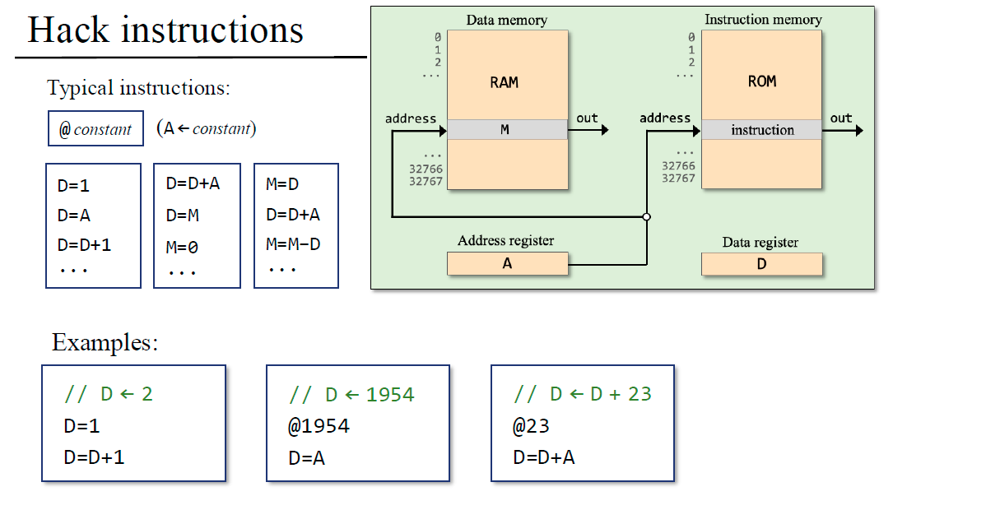
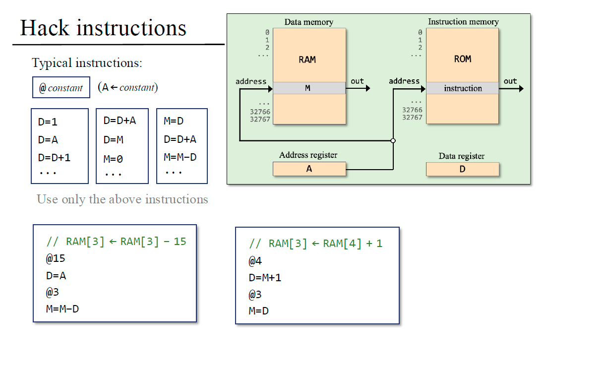
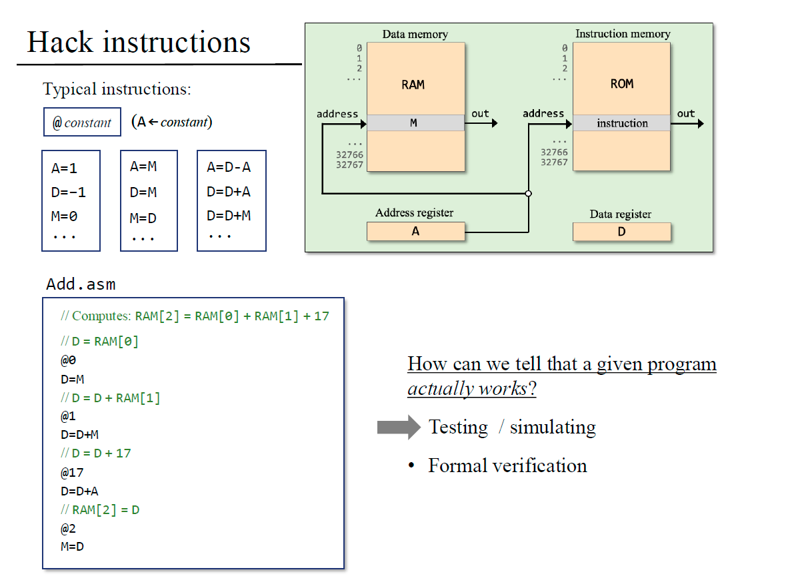

# curso nand2tetris #

El curso Nand2Tetris es un proyecto educativo creado por Noam Nisan y Shimon Schocken en el que los estudiantes construyen, paso a paso, una computadora completa a partir de compuertas lógicas básicas

# Palabras clave#
-Registros
-ALU     
-instruction register: holds an instruction(i)
-Data register: holds data values
-Adress register: holds an adress.

En la teoría de computación debemos entender que así como la memoria almacena datos, puede almacenar programas, a los ojos del mundo de la computación podemos decir que Programas = datos.

Podemos definir un computador como un procesador (CPU) que manipula un conjunto de registros, y hay 2 tipos de registros, CPU-resident register(pocos, se accede directamente por el nombre) y Memory resident registers(muchos, se accede por medio de la dirección).

 En conjunto, la arquitectura se basa en que la CPU lee instrucciones y datos desde memoria, los procesa y se comunica mediante los buses con los periféricos para interactuar con el usuario.
 