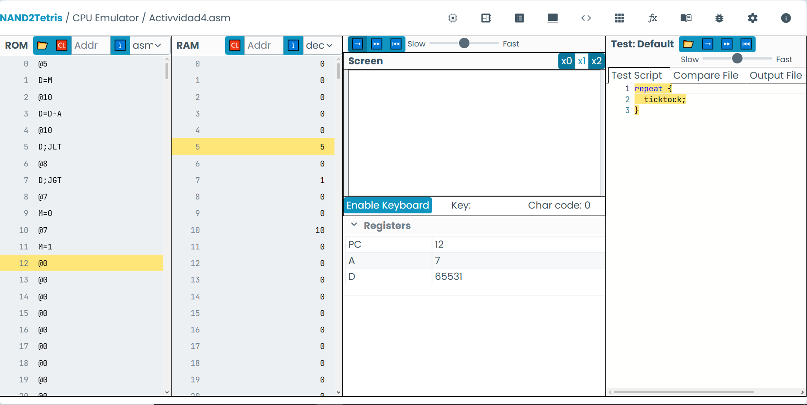
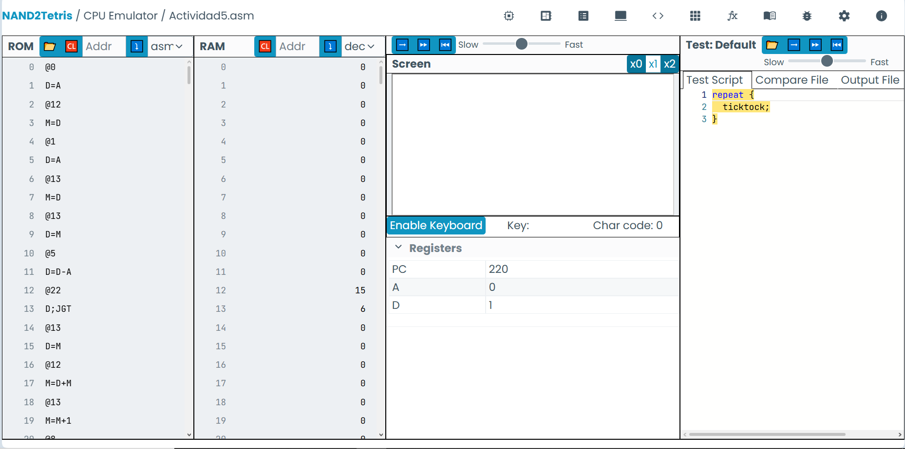

# Bitácora de sistemas computacionales - Unidad 1 #

## Objetivo ##

comprender la arquitectura de un computador digital moderno utilizando los recursos disponibles en nan2tetris y el recurso de computador hack en lenguaje ensamblador

## Objetivos específicos ##
- Comprender la arquitectura de un computador.
- Conocer el lenguaje ensamblador.
- Desarrollar programas interactivos simples.
- Manipular la memoria.
- Realizar operaciones aritmético-lógicas.
- Controlar el flujo de un programa.
- Manejar la entrada y salida de datos.

# Actividad 1#

para la actividad 1 tomé nota en un archivo markdown que se encuentra dentro de la carpeta de investigación

# Actividad 2#

EL programa ejecutó correctamente la representación del ciclo fetch-decode-execute, en el que identificó espacios de memoria señalados por A. Todo esto ocurre gracias a una ciclo realizado por la CPU. en este caso está moviendo datos entre registros.

En la dirección de memoria 16 se encuentra el data register que estabamos llevando, en este caso un 3, al final el programa queda en un loop que no entiendo

Luego realicé yo mismo un programa de fetch-decode execute que suma el 10 y el 5 y los almacena en el espacio de memoria 20, si bien el programa para ejecutar el computador hack no me muestra la M, confío en que el resultado es correcto, referirse a Experimento1.asm.

# Actividad 3#

Como yo había llegado tarde, estaba desatrasandome y llegué a ver el desarrollo de esta actividad en clase, el programa realiza un ciclo que verifica si una tecla está presionada, mientras lo esté pintará los pixeles de la pantalla 1 a 1 de izquierda a derecha.

# Actividad 4#

Podemos ver que el programa se ejecuta de manera correcta, pues siendo el valor 5 en @5 y 10 en @10, es menor y vemos un 1 escrito en @7

# Actividad 5#

COmo podemos evidenciar, en el espacio 12 de memoria se puede ver la sumatoria de los numeros del uno al 5, la cual es 15, el programa funciona correctamente, la manera de implementarlo fue utilizando un ciclo que funcionara mientras un contador fuera menor o igual que 5, así mismo este contador se utilizaba para sumar cada vuelta del loop al resultado final.

# Actividad 6#

Revisar .md correspondiente

