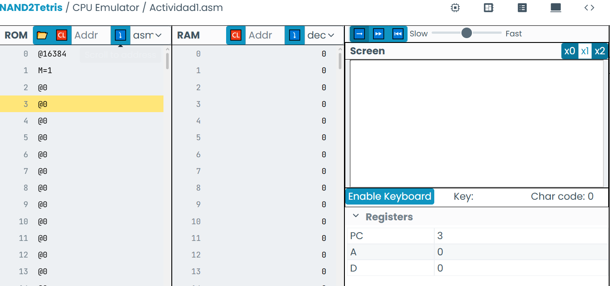
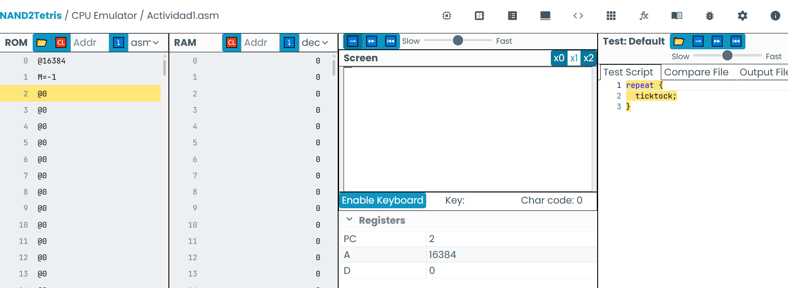
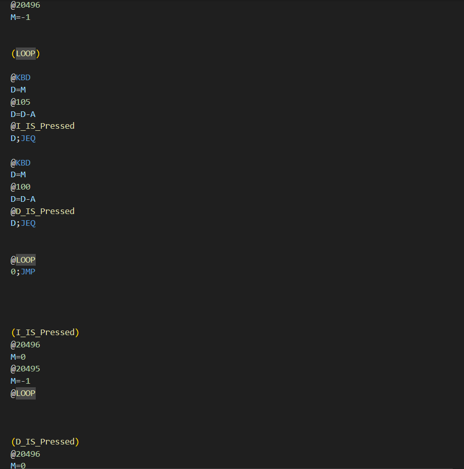
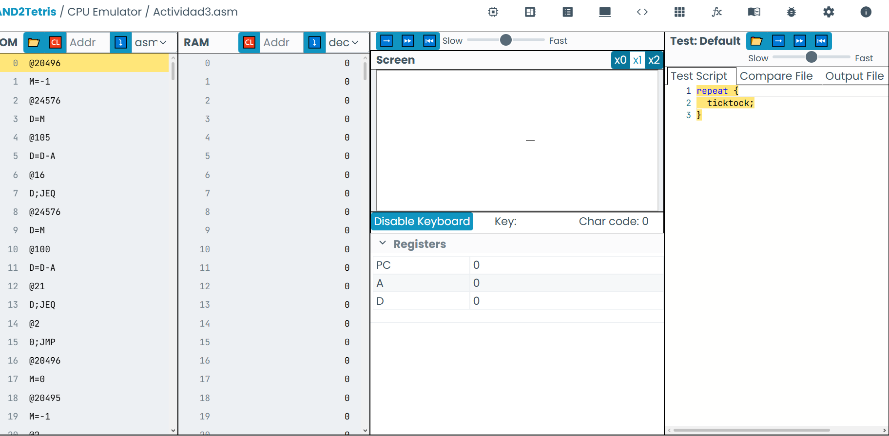
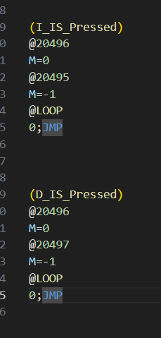

# Unidad 2#

## objetivo ##

En esta unidad aprenderás la relación entre el lenguaje ensamblador y un lenguaje de alto nivel como C++. Aprenderás a traducir conceptos de alto nivel a bajo nivel, y viceversa. Además, desarrollarás programas que implementan estos conceptos en el lenguaje ensamblador del computador Hack. Vas a explorar estos conceptos usando el simulador del Hack. Y por favor, SIEMPRE SIMULA y aplica la metodología de predice, ejecuta, observa y reflexiona.

# Actividad 1#

En la actividad 1 aprendimos como pintar el primer pixel de la pantalla (superior izquierdo utilizando el lenguaje ensamblador), la dirección de la pantalla @screen corresponde al registro 16384 y en binario, un 1 corresponde a un pixel pintado del registro que contiene 16.

# Actividad 2#

Siguiendo la misma idea, la segunda actividad consistía en pintar todos los pixeles del registro, para esto se utiliza el -1.

# Actividad 3#  

Para puntualizar un registro en la pantalla se utiliza la siguiente formula @SCREEN + 32*fila + columna/16

Desarrollé una primera versión 

Arrojó los siguientes resultados 

En la prueba la ejecución de la primera ejecución con el teclado funciona correctamente, pero las subsecuentes no y en ocasiones fallaba con la instrucción principal, aquí decidí apoyarme de la IA, aquí e di cuenta de que el error residía en la falta de saltos después de cada método, (ver codigo corregido a continuación).
