# Unidad 2#

## objetivo ##

En esta unidad aprenderás la relación entre el lenguaje ensamblador y un lenguaje de alto nivel como C++. Aprenderás a traducir conceptos de alto nivel a bajo nivel, y viceversa. Además, desarrollarás programas que implementan estos conceptos en el lenguaje ensamblador del computador Hack. Vas a explorar estos conceptos usando el simulador del Hack. Y por favor, SIEMPRE SIMULA y aplica la metodología de predice, ejecuta, observa y reflexiona.

IMPORTANTE: La metodología que estoy siguiendo con la mayoría de estos ejercicios es escribir el código primero, probarlo, y si algo falla corregirlo y ver explicaciones con GEMINI como programa de IA.

# Actividad 1#

En la actividad 1 aprendimos como pintar el primer pixel de la pantalla (superior izquierdo utilizando el lenguaje ensamblador), la dirección de la pantalla @screen corresponde al registro 16384 y en binario, un 1 corresponde a un pixel pintado del registro que contiene 16.

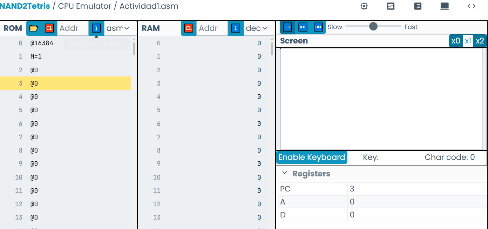

# Actividad 2#

Siguiendo la misma idea, la segunda actividad consistía en pintar todos los pixeles del registro, para esto se utiliza el -1.

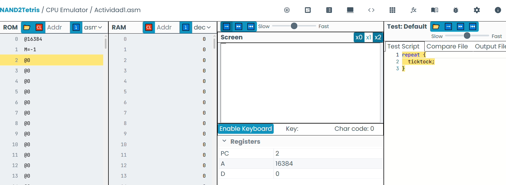

# Actividad 3#  

Para puntualizar un registro en la pantalla se utiliza la siguiente formula @SCREEN + 32*fila + columna/16

Desarrollé una primera versión 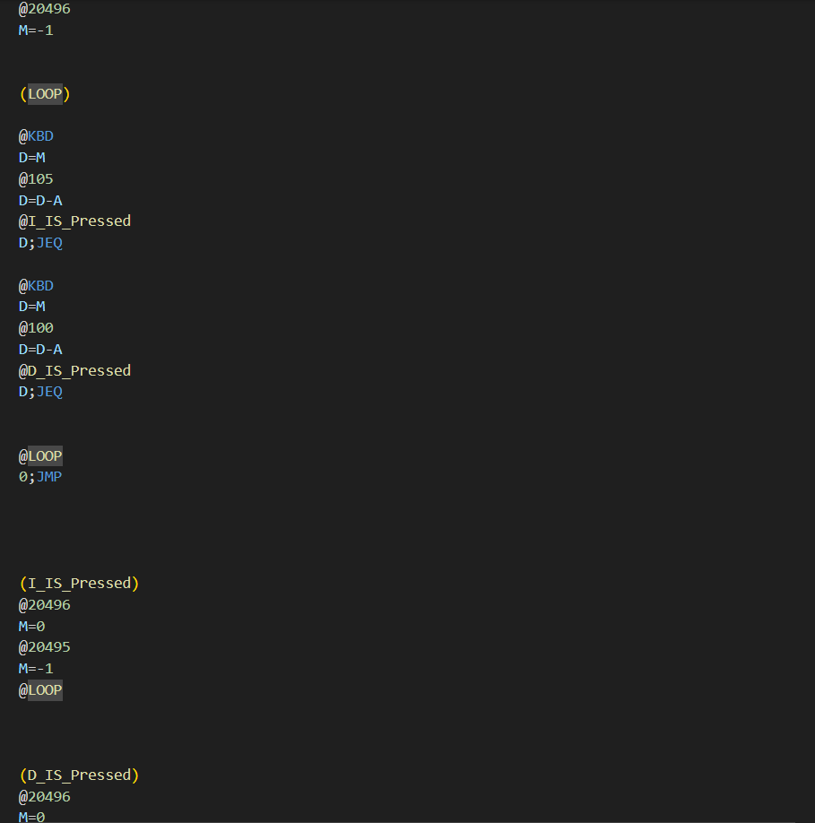

Arrojó los siguientes resultados 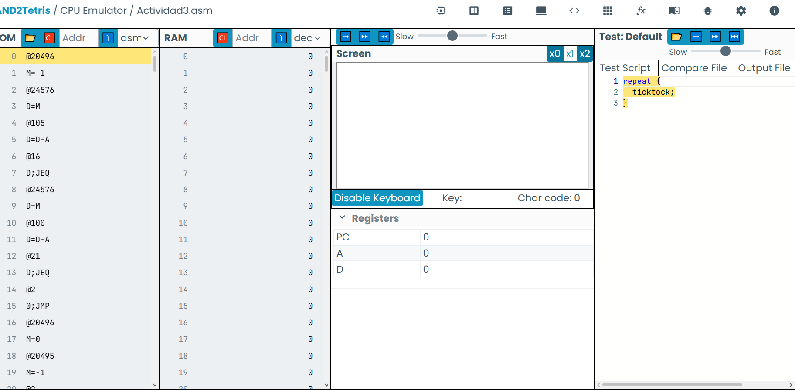

En la prueba la ejecución de la primera ejecución con el teclado funciona correctamente, pero las subsecuentes no y en ocasiones fallaba con la instrucción principal, aquí decidí apoyarme de la IA, aquí e di cuenta de que el error residía en la falta de saltos después de cada método, (ver codigo corregido a continuación).
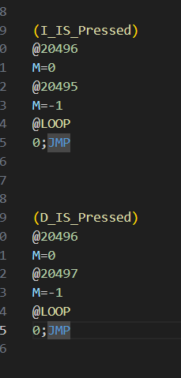

# Actividad 4#

El código ensamblador generado para un for y un while es idéntico. El procesador no tiene un concepto de "ciclo for"; simplemente usa etiquetas, comparaciones y saltos (JMP, JGT, etc.).
No hay una ventaja de rendimiento de uno sobre el otro en términos de velocidad de ejecución, ya que el conjunto de instrucciones resultante es el mismo.  
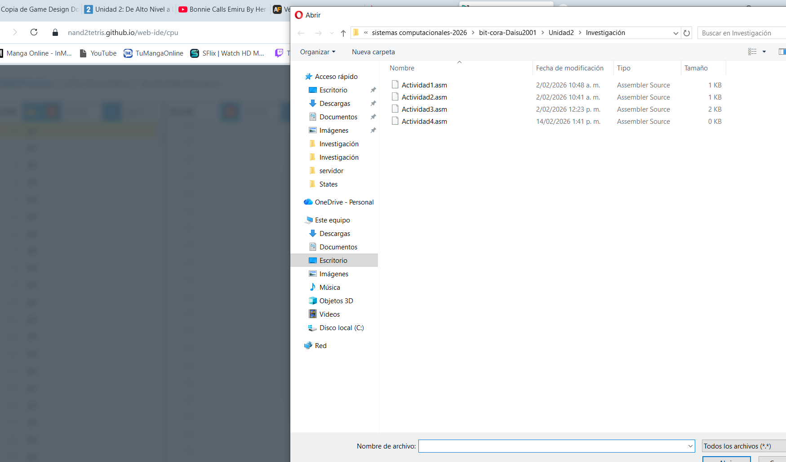

Así se ve la ejecución en el sistema de cpu virtual.

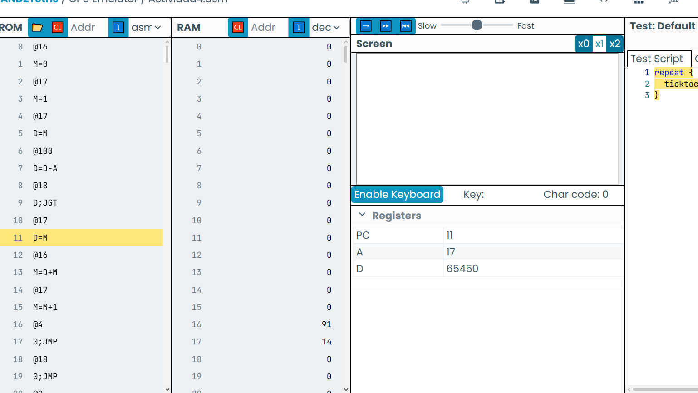

# Actividad 5#

Partiendo del código en C, es incluso más fácil de comprender en assembly porque realmente estás utilizando los espacios de memoria de la misma manera que antes, solo referenciando espacios específicos por medio de otros nombres.

el código funcionó correctamente la primera vez.

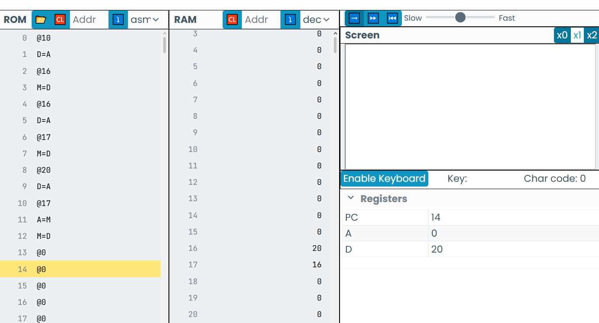

# Actividad 6#

Al principio organicé el código partiendo de la posición 16 de la ram,

@sum
M=0
@arr
D=M 

sin embargo me estaba presentando problemas al funcionar, entonces lo corregí con IA y aprendí que:

Aunque el ensamblador asigna variables a partir de la RAM 16, para trabajar con arreglos debemos gestionar el bloque de memoria manualmente para garantizar que los datos estén en posiciones contiguas y que el puntero pueda avanzar correctamente de una dirección a la siguiente (p++)

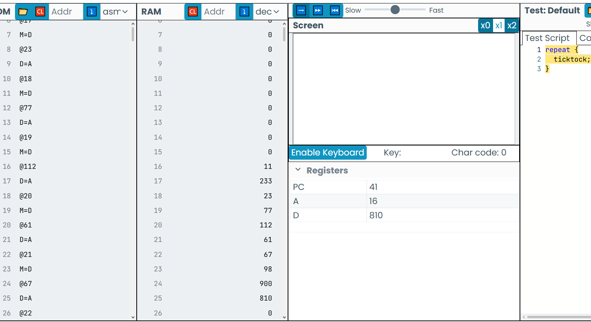  aquí podemos observar que el arreglo se inicializó correctamente.

Este fue el primer paso, a continuación hay que acceder al puntero

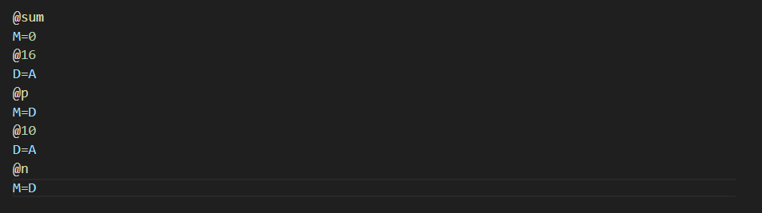

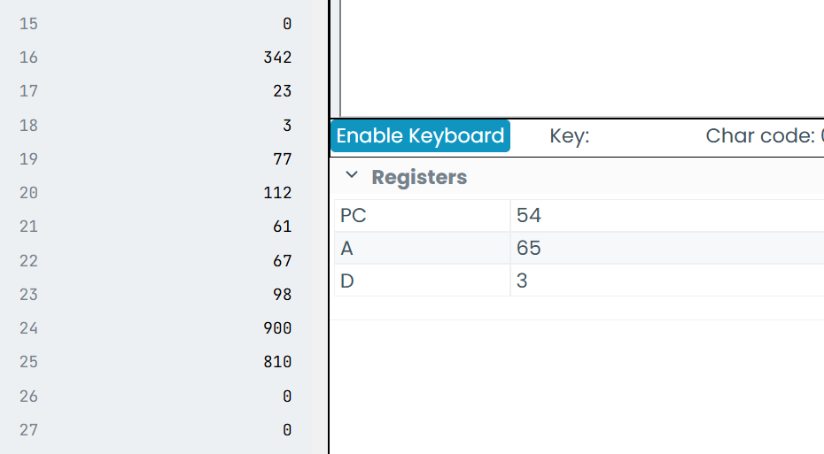

vemos como los espacios de memoria cambian, y @p y @n empiezan a controlar el flujo del ciclo realizado en el tercer paso, toman los valores necesarios para la suma, y el numero de veces que debe hacerse.

Y el tercer paso sería implementar un ciclo en el que se sumen los valores de cada posicón del arrelo en @sum, y se modifique el contador por el numero de elementos en el arreglo

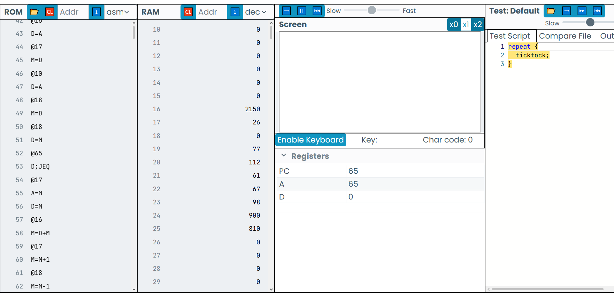

Al final vemos la sumatoria de los numeros del arreglo en la posición 16.

# Autoevaluación#

1. Un puntero es una variable que guarda un numero, que se interpreta como una dirección en la RAM

p = &a 

----------

@a
D=A
@p
M=D

////////////////

*p = 20

----------

@20
D=A
@p
A=M
M=D

Para acceder a un arreglo: 

Dirección Base : Es la ubicación en la RAM donde comienza el primer elemento

Índice (j): Es la distancia desde el inicio del arreglo. 

@16     
D=A     
@j      
D=D+M  

@p_temp 
M=D     

A=M     
D=M     

2.  Siento que la parte más dificil fue la de los arreglos, pues hay que tener un entendimiento básico múcho más elevado del sistema ensamblador, para lograr entenderlo, fue necesario prestar atención en clase, equivocarme intentdno implementarlo, y ver con atención las correcciones realizadas por la IA

En el paso a paso, decidí separar el problema por partes, que es como hemos venido trabajando desde el inicio del semestre, y más que un paso a paso en la ejecución, como tenía claro el proceso y resultado deseado, ejecuté las parte fundamentales del programa una tras implementar otra, primero el arreglo, luego el puntero, y finalmente la funcionalidad del ciclo.

El concepto que siento es más fácil de identificar y trabajar son los punteros, ya que funcionan casi como una variable en lenguaje de alto nivel.