la exploración de uno de los lenguajes de programación más importantes en la industria del entretenimiento digital: C++. Sin embargo, nuestro objetivo no es aprender C++, no es el fin, C++ será el medio a través del cual explorarás algunos conceptos básicos que ya has usado (C#), pero que ahora analizarás más a fondo.

# actividad1#

En la Unidad 3 comenzamos haciendo un estudio de lenguaje de alto nivel C++ en una 
aplicación de consola en un principio ejecutando un "hola mundo", luego transformandolo en la suma de 2 enteros

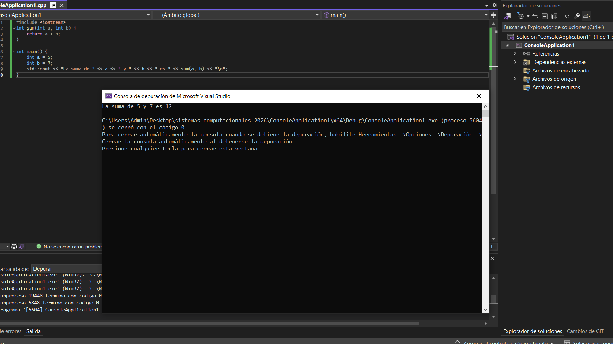

aqui luego aprendemos a utilizar los breakpoints, que funcionan como puntos de referencia en el código en el que el programa se detendrá, y nos permitirá analizar luego en un paso a paso el codigo ejecutado desde ese punto, y el menú de autos nos permite ver los valores que toman las variables y los procesos realizados en cada paso.

# Actividad 2#

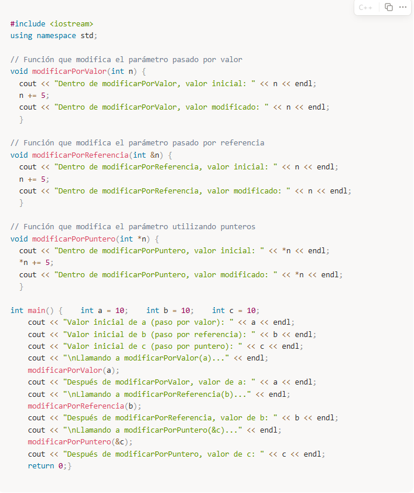

nos entregan este código y debemos trabajar en base e a el: primero prediciendo los outputs de estas funciones

modificarporvalor

modificarporreferencia

modificar por puntero

en un principio mi predicción es que todas fueran iguales, sin embargo, al ejecutar el código veo diferencias, en modificar por valor, sigue el proceso como me lo había imginado, sin embargo al final entrega el valor inicial aun después de ejecutar la función, se me ocurre que puede que el valor fuera de la función no se vé modificado.

Para entender mejor el funcionamiento de estos busqué en línea las funciones una por una para entenderlas mejor

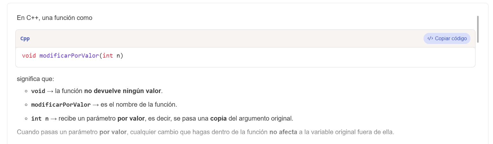
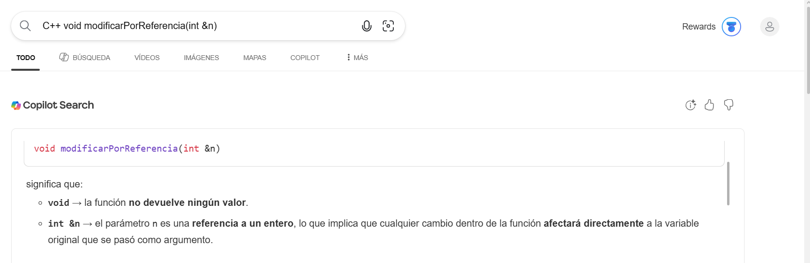
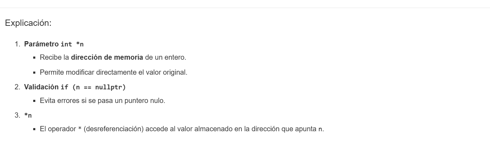

se ue se aclara que no se debe usar IA para esta unidad, sin embargo esta búsqueda fue directa desde visual studio cuando seleccionas la funcion y le das click en buscar en línea, y fue investigativo.

tras entender esto entiendo perfectamente los resultados del programa inicial, modificar parámatros por referenciacion o por punteros si alteran el valor o la variable original, mientras que por valor, crea una copia de la variable.

luego todo esto es explicado en la unidad, pero hacer la investigación propia previa, me hace entenderlo mejor.

Al final nos dejan un ejercicio de realizar un swap entre las variables, tomé el código del ejercicio anterior, lo edité sin ayuda, y funcionó perfectamente (ver codigo en actividad2.cpp)

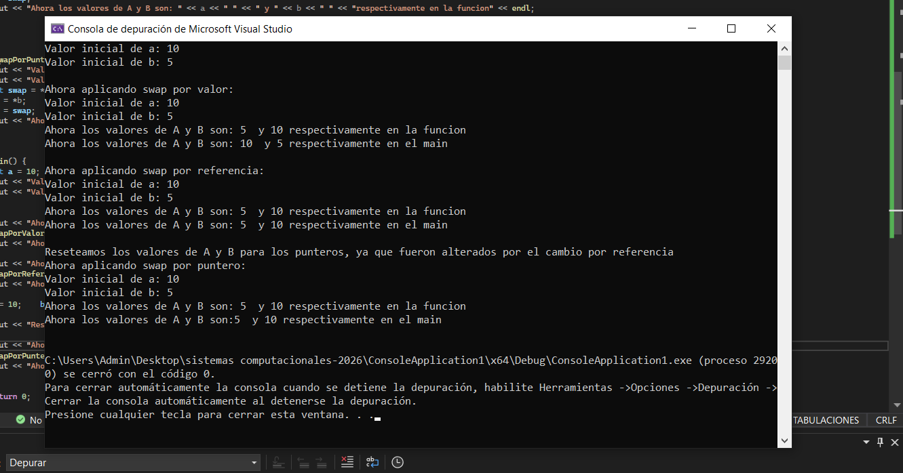

realmente pasé más tiempo generando un print limpio en espacios y caractéres que haciendo la lógica.

# Actividad 3#

En esta actividad estamos anilazando los espacios de memoria utilizados por un programa en c++, estos son (segmento de codigo, variables globales y estáticas, heap y stack). la actividad que ve realizada en actividad3.cpp es un ejemplo muy bueno y en los comentarios se ve en que espacios se está ejecutando cada parte del código

# Actividad 4#

Aquí realizaremos una serie de experimentos en c++ que nos harán evidenciar como funciona el programa en terminos de memoria, el código está en actividad4.cpp.

Las reflexiones son:

1. Aquí podemos ver como el programa se detiene al intentar escribir en la dirección de memoria del main, que es de solo lectura y ejecución, entonces el programa se detiene.
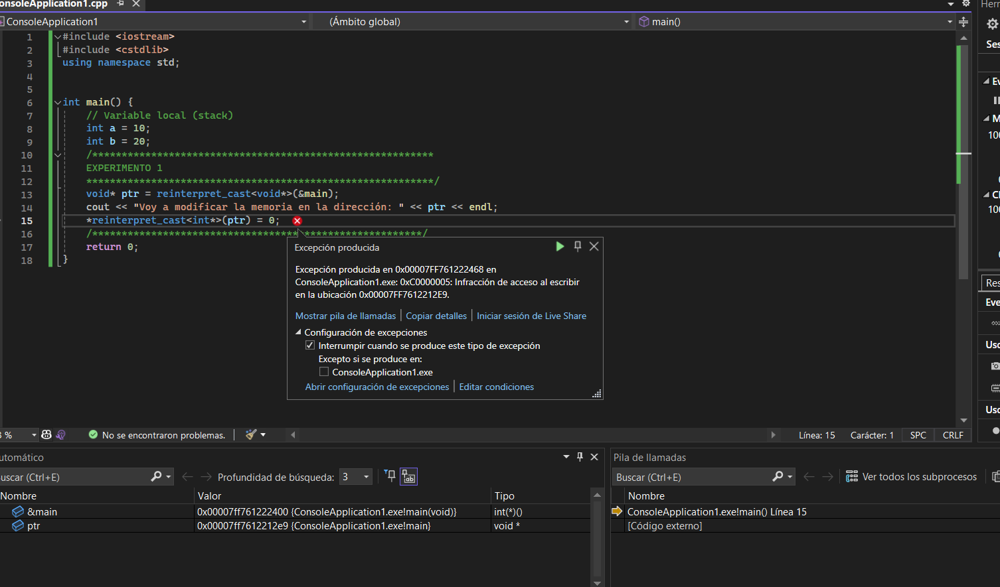

2. Lo que sucede aquí es que almacenamos una variable de sólo lectura, y estamos intentando editarla con un puntero, lo que nos lleva a que el programa tenga un error.

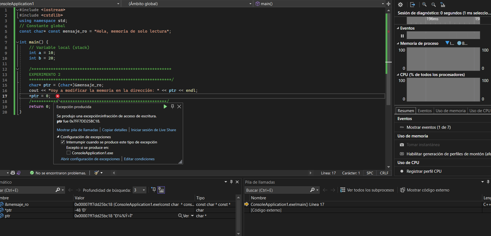

3. Aquí podemos ver cómo las variables globales tienen permisos de escritura y lectura, entonces al cambiarlos no genera ningun error, y se pueden volver a utilizar.

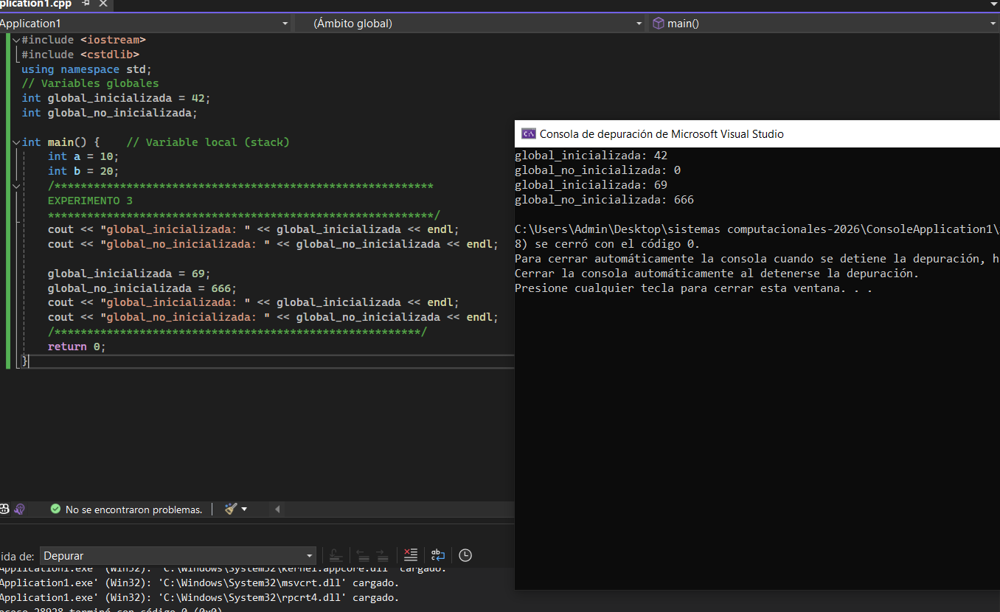

4. aquí obtenemos un error de compliación gracias a que var_estatica está siendo llamada dentro del main, pero esta solo funciona en funcionConStatic(), y no se puede traer de manera tan sencilla del otro ámbito.

las variables que entran en la función se guardan en el stack, y al salir son borradas y se libera el espacio de memoria.

y las variables locales estáticas no se guardan en el stack, sino en el segmento de variables globales y estáticas, y aunque no se eliminan durante la ejecución del código, están restringidas a la función que habitan.

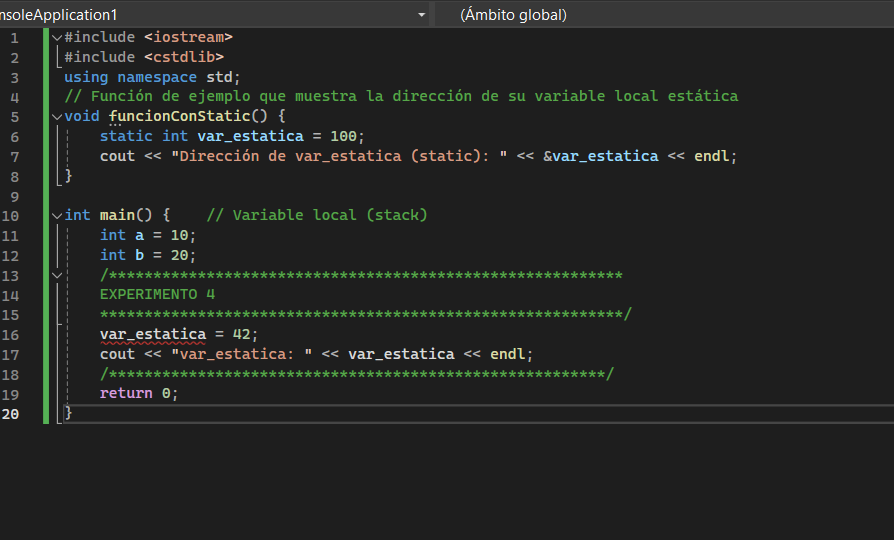

5. Aquí vemos que una de las variables se ve afectada por el ++ y la otra no, esto se debe a que las variables no estáticas se reinician cada vez que son llamadas, mientras que las estáticas habitan un espacio de memoria que no se ve afectado al volver a llamar la función

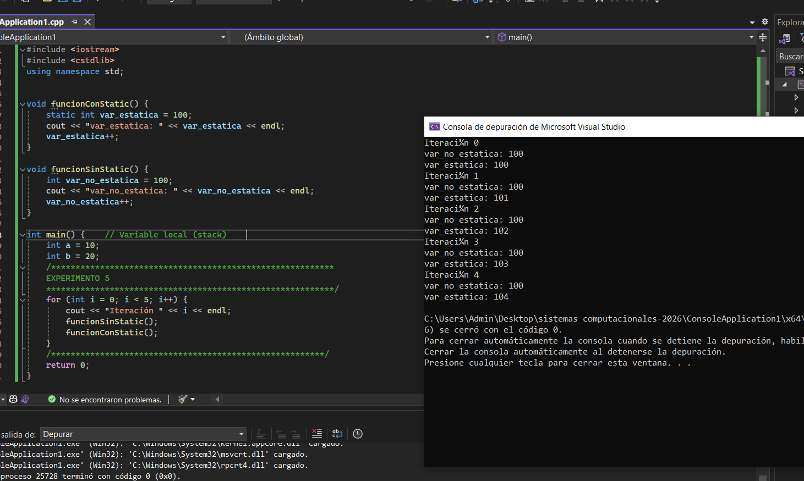

6.  Aquí obtenemos otro error ya que estamos intentando acceder a un arreglo del cual se liberó el espacio de memoria anteriormente

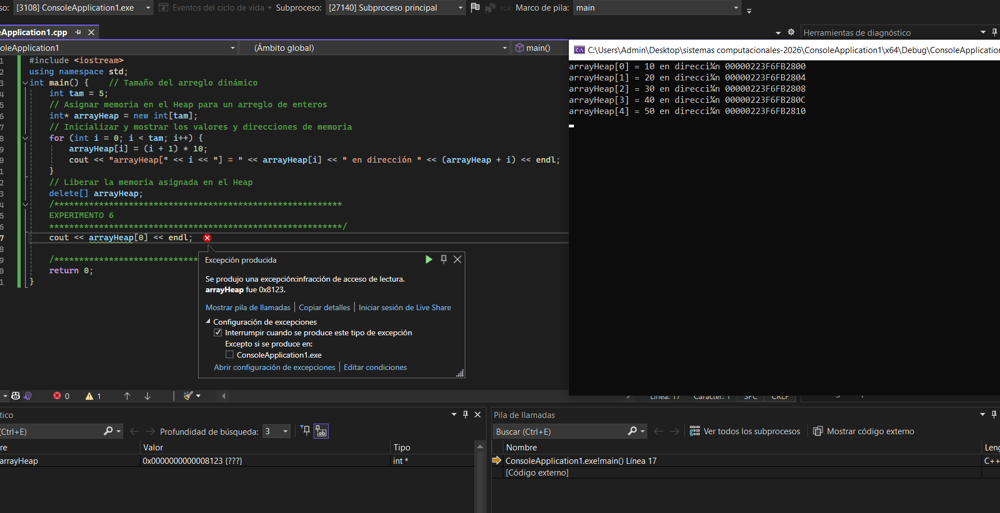

Diferencias: el stack funciona de manera automática, mientras que el heap debes indicarle cuando pedir y borrar memoria

El stack tiene espacio de memoria limitado, por lo que es mejor utilizar el heap para estructuras grandes y que cambian.

si no utilizas delete, el espacio de memoria quedará ocupado cada vez que se ejecute el ciclo, por lo que probablemente termine utilizando toda la ram.