la exploración de uno de los lenguajes de programación más importantes en la industria del entretenimiento digital: C++. Sin embargo, nuestro objetivo no es aprender C++, no es el fin, C++ será el medio a través del cual explorarás algunos conceptos básicos que ya has usado (C#), pero que ahora analizarás más a fondo.

# actividad1#

En la Unidad 3 comenzamos haciendo un estudio de lenguaje de alto nivel C++ en una 
aplicación de consola en un principio ejecutando un "hola mundo", luego transformandolo en la suma de 2 enteros

aqui luego aprendemos a utilizar los breakpoints, que funcionan como puntos de referencia en el código en el que el programa se detendrá, y nos permitirá analizar luego en un paso a paso el codigo ejecutado desde ese punto, y el menú de autos nos permite ver los valores que toman las variables y los procesos realizados en cada paso.

# Actividad 2#

nos entregan este código y debemos trabajar en base e a el: primero prediciendo los outputs de estas funciones

modificarporvalor

modificarporreferencia

modificar por puntero

en un principio mi predicción es que todas fueran iguales, sin embargo, al ejecutar el código veo diferencias, en modificar por valor, sigue el proceso como me lo había imginado, sin embargo al final entrega el valor inicial aun después de ejecutar la función, se me ocurre que puede que el valor fuera de la función no se vé modificado.

Para entender mejor el funcionamiento de estos busqué en línea las funciones una por una para entenderlas mejor

se ue se aclara que no se debe usar IA para esta unidad, sin embargo esta búsqueda fue directa desde visual studio cuando seleccionas la funcion y le das click en buscar en línea, y fue investigativo.

tras entender esto entiendo perfectamente los resultados del programa inicial, modificar parámatros por referenciacion o por punteros si alteran el valor o la variable original, mientras que por valor, crea una copia de la variable.

luego todo esto es explicado en la unidad, pero hacer la investigación propia previa, me hace entenderlo mejor.

Al final nos dejan un ejercicio de realizar un swap entre las variables, tomé el código del ejercicio anterior, lo edité sin ayuda, y funcionó perfectamente (ver codigo en actividad2.cpp)

realmente pasé más tiempo generando un print limpio en espacios y caractéres que haciendo la lógica.

# Actividad 3#

En esta actividad estamos anilazando los espacios de memoria utilizados por un programa en c++, estos son (segmento de codigo, variables globales y estáticas, heap y stack). la actividad que ve realizada en actividad3.cpp es un ejemplo muy bueno y en los comentarios se ve en que espacios se está ejecutando cada parte del código

# Actividad 4#

Aquí realizaremos una serie de experimentos en c++ que nos harán evidenciar como funciona el programa en terminos de memoria, el código está en actividad4.cpp.

Las reflexiones son:

1. Aquí podemos ver como el programa se detiene al intentar escribir en la dirección de memoria del main, que es de solo lectura y ejecución, entonces el programa se detiene.

2. Lo que sucede aquí es que almacenamos una variable de sólo lectura, y estamos intentando editarla con un puntero, lo que nos lleva a que el programa tenga un error.

3. Aquí podemos ver cómo las variables globales tienen permisos de escritura y lectura, entonces al cambiarlos no genera ningun error, y se pueden volver a utilizar.

4. aquí obtenemos un error de compliación gracias a que var_estatica está siendo llamada dentro del main, pero esta solo funciona en funcionConStatic(), y no se puede traer de manera tan sencilla del otro ámbito.

las variables que entran en la función se guardan en el stack, y al salir son borradas y se libera el espacio de memoria.

y las variables locales estáticas no se guardan en el stack, sino en el segmento de variables globales y estáticas, y aunque no se eliminan durante la ejecución del código, están restringidas a la función que habitan.

5. Aquí vemos que una de las variables se ve afectada por el ++ y la otra no, esto se debe a que las variables no estáticas se reinician cada vez que son llamadas, mientras que las estáticas habitan un espacio de memoria que no se ve afectado al volver a llamar la función

6.  Aquí obtenemos otro error ya que estamos intentando acceder a un arreglo del cual se liberó el espacio de memoria anteriormente

Diferencias: el stack funciona de manera automática, mientras que el heap debes indicarle cuando pedir y borrar memoria

El stack tiene espacio de memoria limitado, por lo que es mejor utilizar el heap para estructuras grandes y que cambian.

si no utilizas delete, el espacio de memoria quedará ocupado cada vez que se ejecute el ciclo, por lo que probablemente termine utilizando toda la ram.

# Actividad 5#

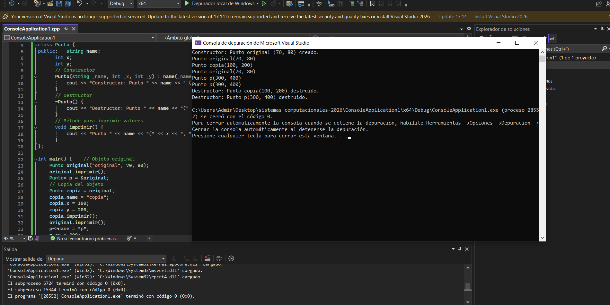
Al obsevar el comportamiento del programa en el depurador, podemos ver como se crea un objeto a partir de un constructor, y esta función puede generar distintos objetos a partir de punteros como copias del original. Es importante destruir los objetos tras la ejecución del código para no tener problemas con la memoria.

Tras hacer la prueba en C# se evidencia como esta "copia" en realidad está remplazando los valores del punto original, me pregunto si utilizando punteros se podría implementar de la misma manera que en c++

El objeto se comporta de manera similar, sin embargo siempre que se llama a punto accede a sus valores directamente en C#.

Tarea:

A.

Funciona de manera igual que en la actividad 2, la referenciación y el uso de punteros si alteran la variable de manera gloval, mientras que la suma por valor, crea un a copia, y realiza la suma que solo es verdadera dentro de esa función, luego no existe.

si funciona como en la actividad 2 espero 20, 30, 30, y el depurador lo confirmó por mi.
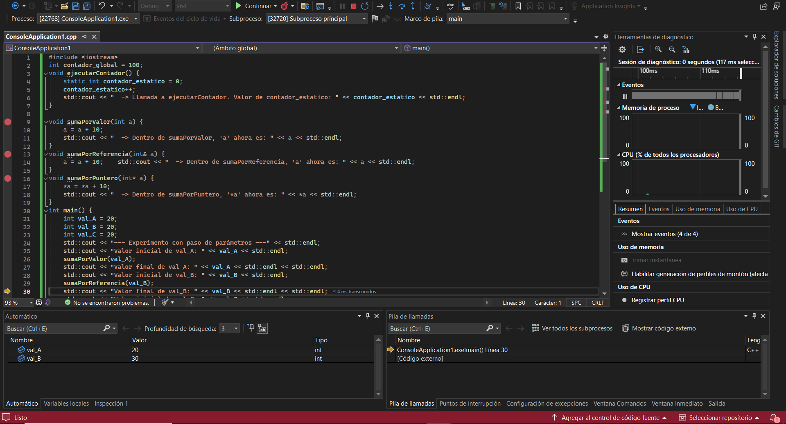

Código(text): main

Datos: contador_global, contador_estático

Stack:  Val_A, Val_B, Val_C

Heap: Vacío

El parámetro a de suma por valor es inexistente, pues fue destruido al finalizar la función.

B. Cómo funciona tal como lo habíamos visto en la segunda actividad, no tuve que analizar mucho el código para entender cómo funcionaba. Entonces sabía con seguridad que valores tendrían antes y después de las funciones.

# Actividad 6#

Tras poner el programa en c++ y ejecutarlo con el depurador, obtengo el comportamiento esperado del código, tras accceder a las direeciones d memoria, y reemplazar en la entrada de texto la dirección por &p, obtuve el siguiente hexadecimal. 0x00000002E44FFBC8

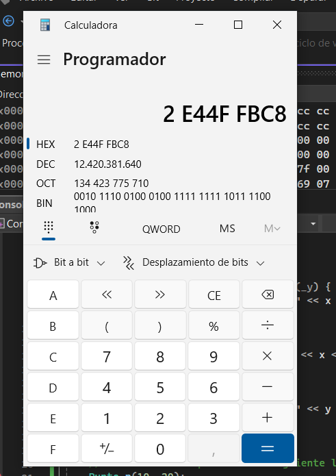

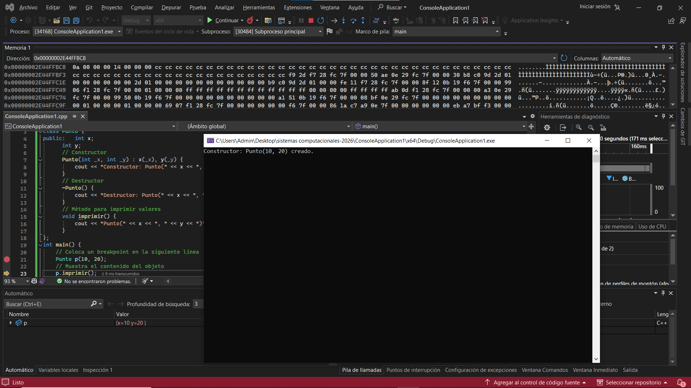

Con 0a obtuve el decimal 10, con 14 el 20

Los valores de los atributos del objeto se almacenan en la memoria en su representación hexadecimal. El depurador muestra que los datos de un objeto son sus variables almacenadas una tras otra.

Si fuera big endian, los datos de P se verían así (00 00 00 0A 00 00 00 14).

1. la diferencia entre un constructor y un destructor en c++ consiste en que el constructor se invoca al crear el objeto y su trabajo es reservar memoria e inicializar atributos, mientras que el destructor se llama cuando el código en el que está el objeto termina de ejecutarse, y su trabajo es liberar memoria.

2.  La clase es la que define el objeto, y no ocupa espacio en stack o heap ya que es código de sólo lectura, mientras que el objeto es la instancia que si ocupa memoria y existe en el código, que trabaja con los parámetros creados en la clase.

3. En c++ el objeto punto p es el objeto mismo, mientras que en c# es una referencia al objeto, y separa la referencia en el stack y el objeto en el heap, en c++ se encuentra en el stack.

4. (en uno de ellos p es un objeto y en el otro es una referencia a un objeto)

5.en C# se separa la referencia en el stack y el objeto en el heap, en c++ se encuentra en el stack.

en conclusión podemos decir que un objeto es un bloque de memoria, que contiene sus datos uno tras otro en el espacio que reserva.

# Actividad 7#

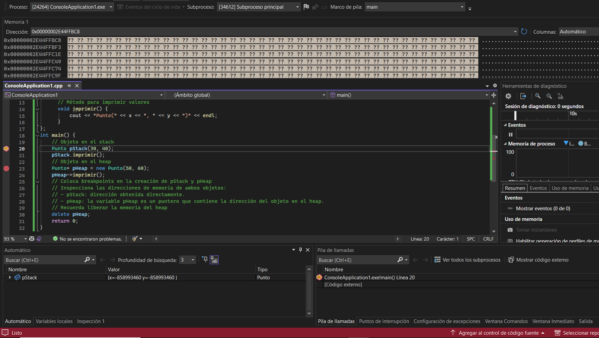
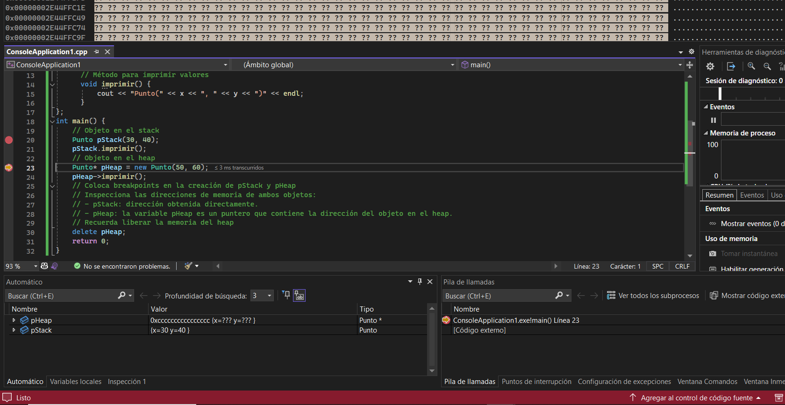

Aquí podemos observar lo explicado en la unidad 2, en el heap vemos como se hace una referencia a los valores almacenados en el espacio de memoria de pstack, y luego utilizando new, accedemos al heap, la memoria dinámica y cambia los valores sin alterar la variable original 

pstack es un objeto y pheap una referencia a uno. a pheap

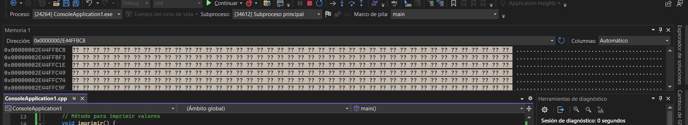 

las direcciones de &pheap indican la ubicación del puntero en sí, mientras que utilizando el objeto real pheap (variable local), vemos los datos del objeto punto.

# Actividad 8#

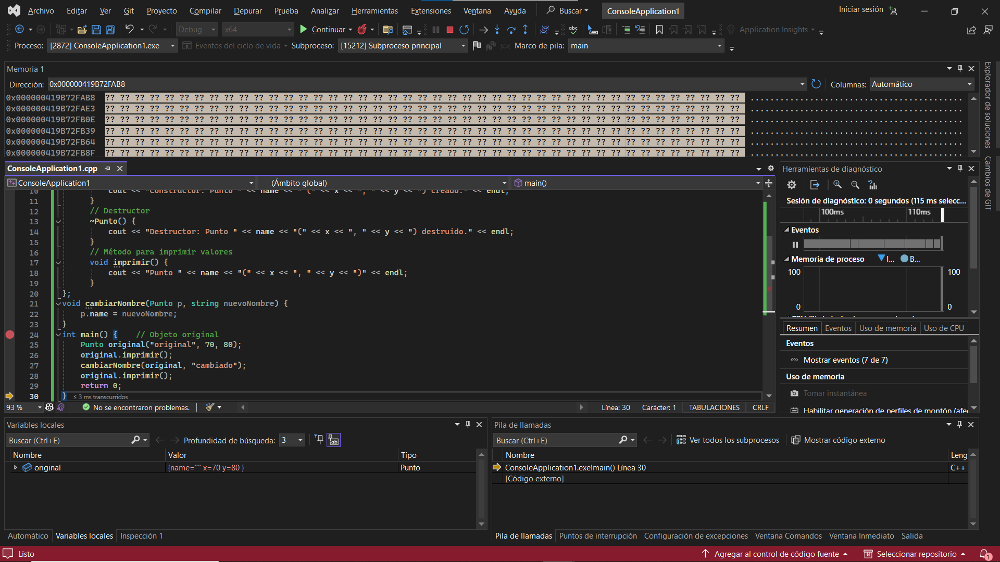

la función cambiar nombre funciona de manera similar a la suma por valor, entonces crea una copia que se destruye después de la función, por eso el destructor es llamado en ese momento. Eso hace que el punto original no se vea afectado ni destruido ya que creaste una copia. original y p ambos se encuentran en el stack, sin embargo uno solo tiene un ciclo de vida dentro de la función cambiar nombre.

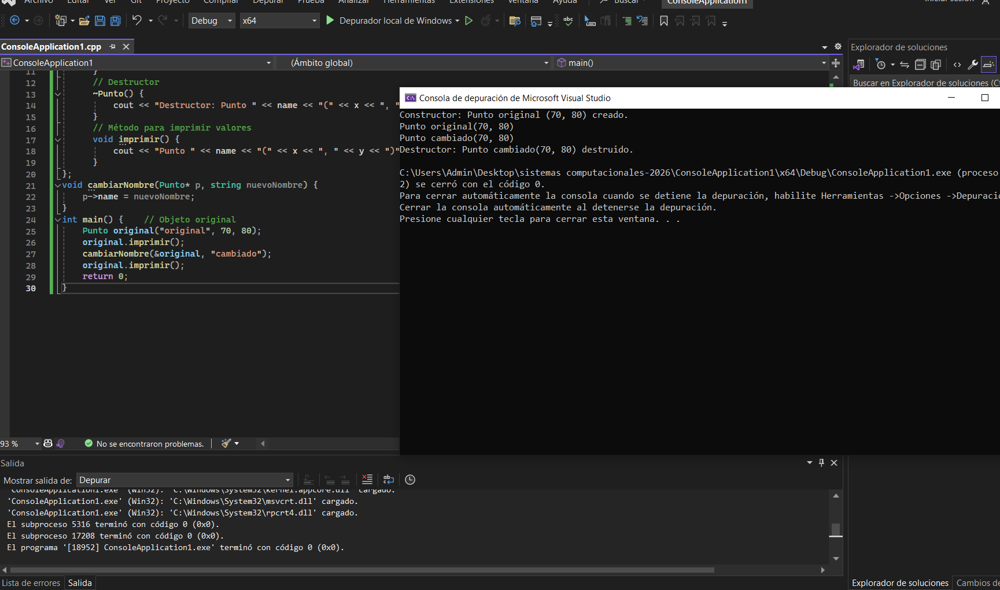

Al cambiar el código para hacerlo por medio de una referencia, resolvemos el probema, pues no se está creando una copia, sino que se está referenciando el espacio donde se encuentra el objeto, y alterando sus variables directamente 

# Actividad 9# 

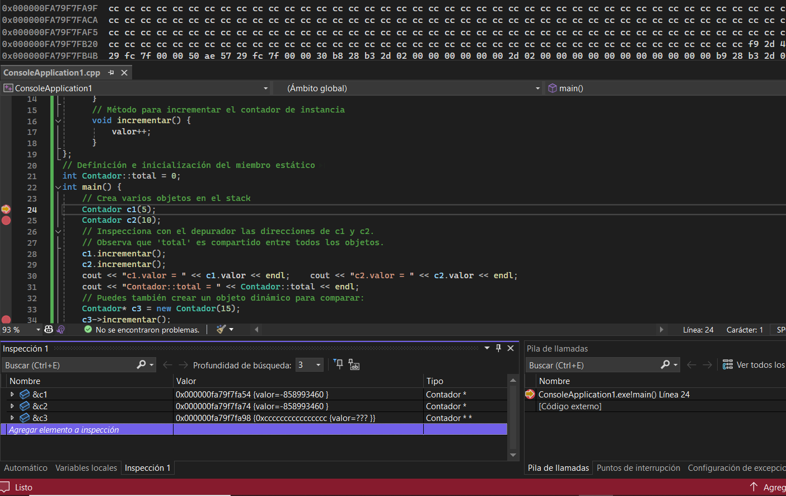

Aquí podemos observar que pesa que c1 y c2 están ubicados en posiciones de memoria distinta, el valor que tienen es el mismo, y total reside fuera del stack como una variable estática.

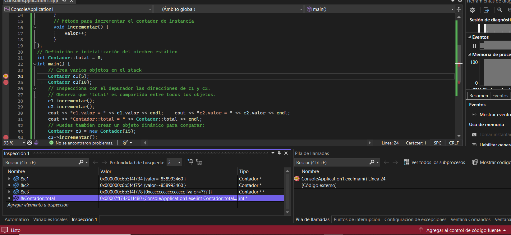

c1 y c2 (Objetos): Se almacenan en el Stack (Pila). Son variables locales de main y su memoria se libera automáticamente al terminar la función. los objetos funcionan así, mientras que las variables estáticas están fuera de él en el segmento de datos como una verdad universal.

Los datos pertenecientes a un objeto requieren de un objeto, mientras que un miembro estático no lo necesita, los objetos tambén tienen su ciclo de vida ligado a su instancia, mientras que los miembros estáticos persisten a lo largo del código, esto hace que no sean buenos para utilizarse en grandes cantidades pues pueden generar problemas en la memoria 

Contador::total (Miembro estático): Se almacena en el Data Segment. No vive dentro de ningún objeto;
c3 (Puntero): Se almacena en el Stack (Pila). Es importante notar que c3 es solo una variable de tipo "dirección de memoria" 

El objeto al que apunta c3: Se almacena en el Heap (Montón). 

# Actividad 10#

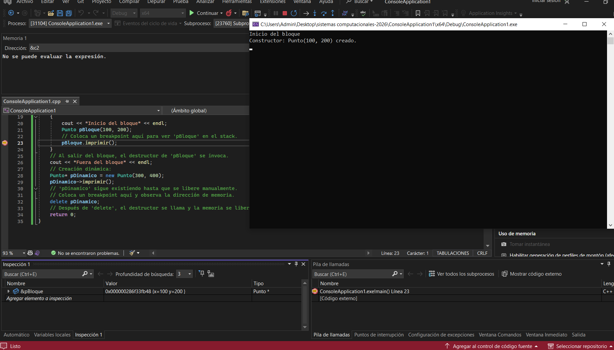

tenemos un código en el que se crea un punto a partir de la función, y otro a través de un puntero con referenciación, podemos ver como el del puntero, que se almacena en el heap, persiste aún fuera del contexto del main.

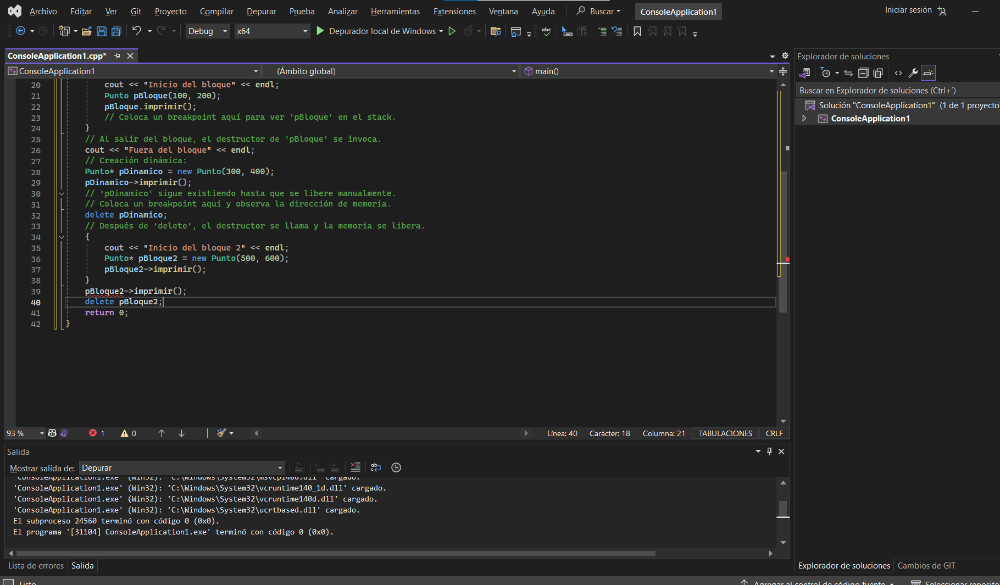

Después de hacer el cambio, no complica, y esto se debe a que el pbloque2 no está definido fuera de la función, el objeto todavía existe, pero el puntero que lo referenciaba no.

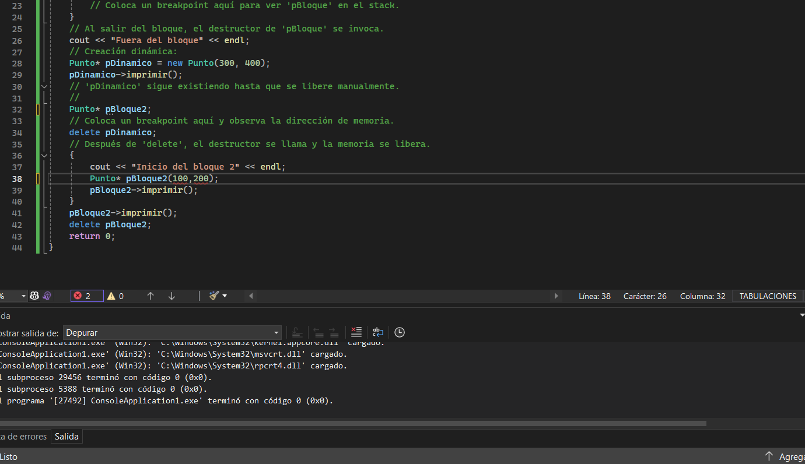

Si intento declarar el punto fuera de la función e inicializarlo después, no compila debido a que el puntero no recibe los parámetros sino que referencia unos ya existentes.

luego con el nuevo código

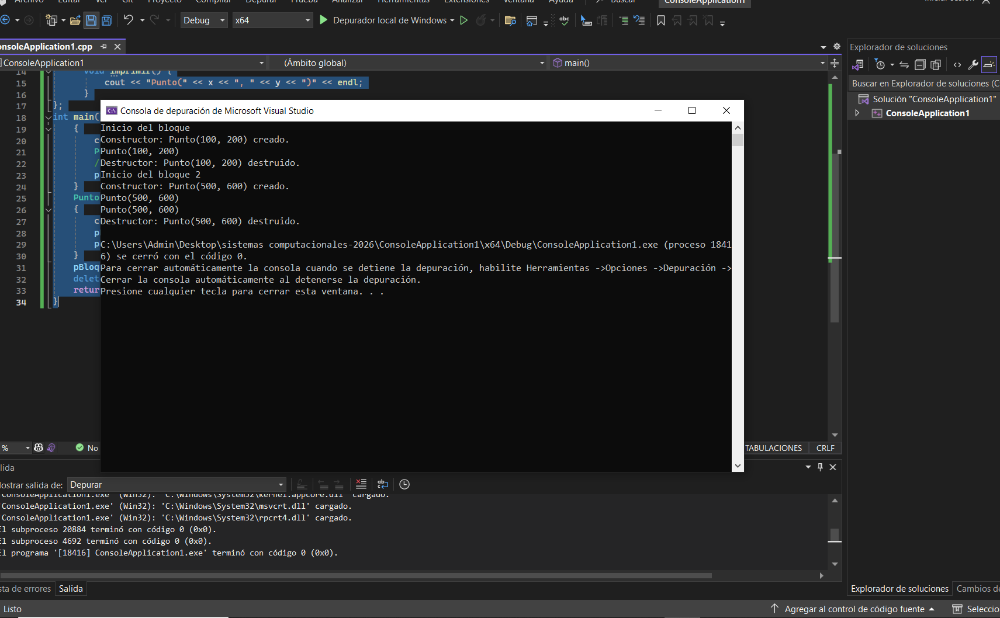
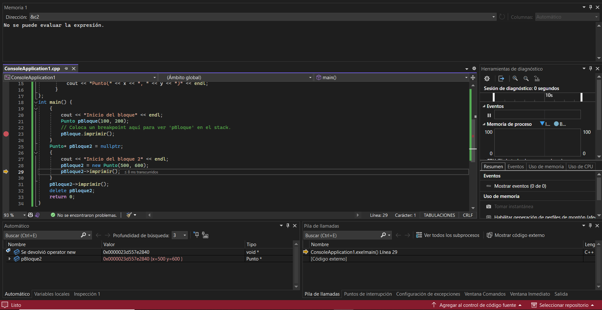

podemos ver que el p2 no se destruye al salir del bloque y el p1 si, esto se debe a los espacios utilizados en memoria, mientras que el p1 se almmacena en el stack, y está sujeto al ciclo de vida de la función en la que es llamado, el p2 se almacena en el heap como una variable dinámica, entonces se crea y se destruye manualmente, el objeto al que apunta p2, si se almacena en el stack.

Actividad: 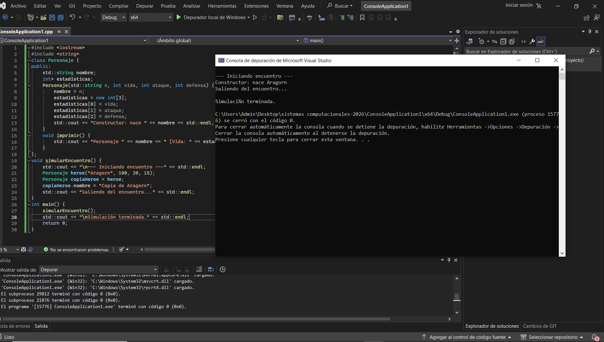

podemos ver claramente que el código no se está ejecutando de manera correcta, no se ven varias líneas que si deberían verse, el primer problema que identifiqué fue que no hay un destructor del personaje, entonces si se accede luego a la memoria va a generar problemas, también, el héroe y la copia tienen las mismas estadísticas, pues apuntan al mismo espacio de memoria, y si luego quisiera destruirlo añadiendo un destructor, uno de los objetos estaría apuntanto a un espacio inexistente.

error 1: falta de un destructor, al faltar un destructor, cuando el personaje sale del contexto, los datos quedan almacenados en el espacio de memoria. y el problema del mecanismo en este caso es a nivel de HEAP

error 2: la copia del héroe y el héroe apuntan al mismo espacio de memoria, es un problema con el stack y con el Heap, no se puede alterar las estadísticas de uno sin alterar las del otro, y cuando uno sea destruido, el programa buscará en un espacio en el heap que no existe. El stack buscará esos datos y crasheará el programa

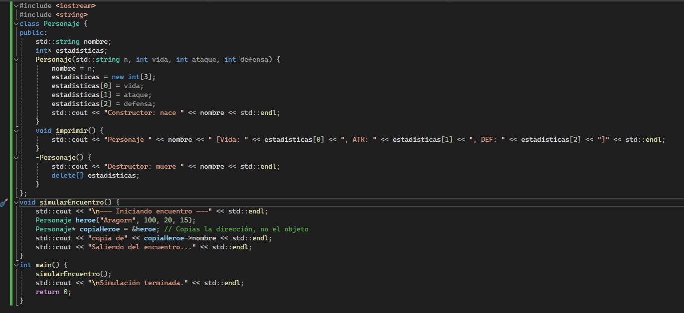

para intentar solucionar los problemas cree un destructor y hice la copia del héroe un puntero, para no tener que preocuparme por su espacio en memoria.

# Actividad 11: autoevaluación#

1. El stack y el heap son partes de la memoria de un programa, el stack funciona de manera más veloz, es un espacio de memoria designado para variables locales y tiene restricciones de tamaño, mientras que el heap es la memoria dinámica, tiene más espacio y es más flexible con su uso, es de gestión manual y es más lento que el stack.

2. Paso por valor: crea una copia de la variable en el entorno, no afecta la variable original, por lo que es bueno cuando quieres hacer eso, y manejar tamaños pequeños, ya que copiar grandes espacios de memoria es ineficiente.

Paso por referencia: la función referencia la variable, esto no crea una copia por lo que no reserva ese nuevo espacio de memoria, se usa cuando quieres modificar la variable original.

paso por puntero: es similar al paso por referencia, pues no creas una copia de la variable original, almacena su dirección, puede ser bueno para parametros nulos, o para gestionar elementos del heap.

3. las variables globales son las que se declaran fuera de las funciones al inicio del programa y están disponibles durante toda su ejecución, se almacenenan en el segmento de datos.

Las variables locales se declaran dentro de una función y se almacenan en el stack y se destruyen al salir de la función

Las variables estáticas también se declaran dentro de funciones, sin embargo también están disponibles fuera de ellas y no se destruyen al salir del bloque.

4. un bloque contiguo de bytes. Cuando instancias una clase, el sistema reserva un espacio de tamaño específico para almacenar exclusivamente sus datos.

La ubicación de los miembros de instancia es normamlente en el stack, a no ser de que los declares con new, y los miembros estáticos se almacenan en el segmento de datos

Parte 2.

1. No tiene un destructor, esto causa problemas con la memoria, pues el objeto siempre ocupa el mismo espacio, y al continuar con el código lo crashea.

2. Mi predicción es que al final dirá que habrá 10 enemigos, porque total enemigos es una variable estática, y sus cambios se guardarán durante toda la ejecución.

3. Luego de haber estudiado la actividad 10, concluyo que lo más optimo en este caso sería aplicar la regla de los 3, sin ayuda de la IA pude aplicarla pues ya la había visto.
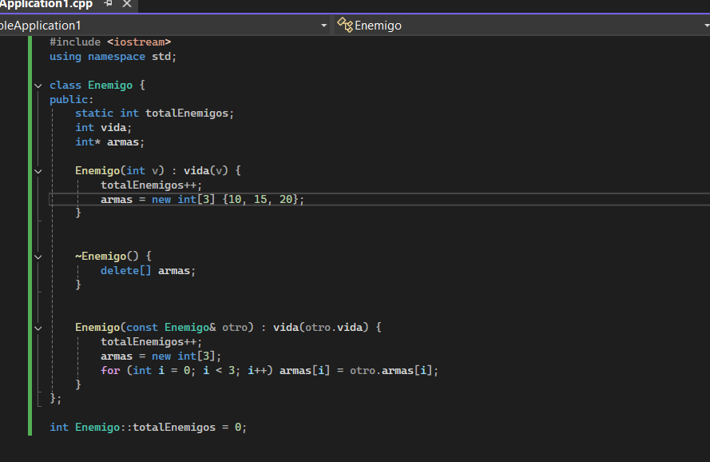

los cambios residen en crear un destructor, y un constructor dedicado en caso de que se quiera crear una copia, para que cada uno tenga su espacio en el heap.

parte 3. 

1. en general creo que considero todo lo que vimos bastante crítico, el manejo de memoria es fundamental para el funcionamiento del programa, cuidar que variables y donde las estás poniendo, cuando las tienes que borrar o cuando persisten a lo largo del código, considero que la clave está en identificar los espacios de memoria y saber donde está almacenada cada variable.

2. en c++ tengo que cuidar bien el espacio en memoria, por que al fin y al cabo eso es un objeto, mientras que en C# se maneja de una manera más automática.

3. porque sino tu código va a tener poca eficiencia o va a crashear, si no manejas el almacenamiento tus variables y funciones van a cargar el código y comerse tu ram.