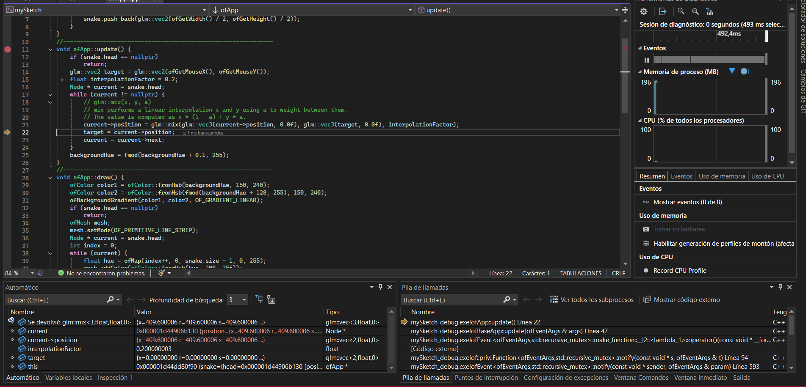
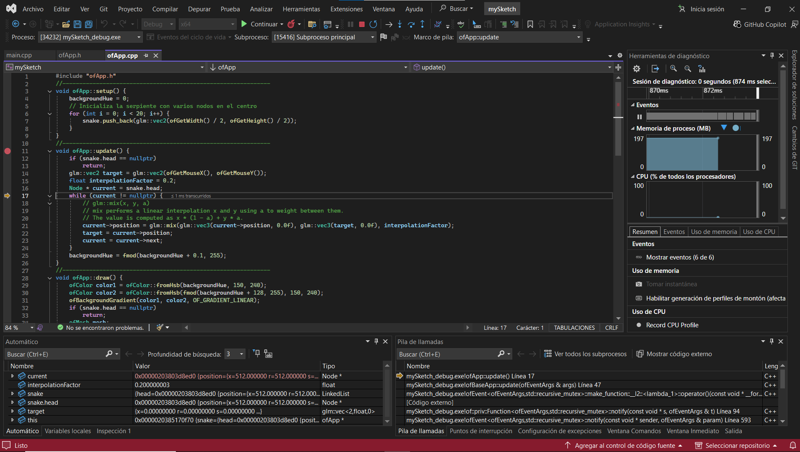

# Actividad 1#

Instalé Open frameworks y cambié el código según dictava la actividad, pude obtener el resultado esperado.

# Actividad 2 y 3# 

A continuación podemos ver el funcionamiento de una lista enlazada, y cómo el tárget, en cada vuelta del cíclo, no es es a dónde apunta el mouse, sino la posición del nodo anterior

así mismo, en la lista cuando realizas un push back, el penultimo nodo se vuelve la cola, y la cabeza se vuelve el nodo con new.

# Actividad 4#

# main.cpp#

#include "ofApp.h"
#include "ofMain.h"
//========================================================================
int main() {
	//Use ofGLFWWindowSettings for more options like multi-monitor fullscreen
	ofGLWindowSettings settings;
	settings.setSize(1024, 768);
	settings.windowMode = OF_WINDOW; //can also be OF_FULLSCREEN
	auto window = ofCreateWindow(settings);
	ofRunApp(window, make_shared<ofApp>());
	ofRunMainLoop();
}

# ofApp.h#

#pragma once
#include "ofMain.h"
// Nodo de la cola
struct Node {
	float x, y;
	float radius;
	ofColor color;
	float opacity;
	Node * next;
	Node(float _x, float _y, float _radius, ofColor _color, float _opacity)
		: x(_x)
		, y(_y)
		, radius(_radius)
		, color(_color)
		, opacity(_opacity)
		, next(nullptr) { }
};
// Implementación manual de una cola (FIFO)
class BrushQueue {
public:
	Node * front;
	Node * rear;
	int size;
	int maxSize;
	BrushQueue(int _maxSize);
	~BrushQueue();
	void enqueue(float x, float y, float radius, ofColor color, float opacity);
	void dequeue();
	void clear();
	bool isEmpty();
};

// Constructor
BrushQueue::BrushQueue(int _maxSize)
	: front(nullptr)
	, rear(nullptr)
	, size(0)
	, maxSize(_maxSize) { }
// Destructor
BrushQueue::~BrushQueue() {
	clear();
}

class ofApp : public ofBaseApp {
public:
	BrushQueue strokes; // Cola de trazos
	float backgroundHue = 0;
	ofApp()
		: strokes(50) { } // Tamaño máximo de la cola
	void setup();
	void update();
	void draw();
	void keyPressed(int key);
};

# ofApp.cpp#

#include "ofApp.h"
//--------------------------------------------------------------
void ofApp::setup() {
	ofBackground(0);
}
//--------------------------------------------------------------
void ofApp::update() {
	backgroundHue += 0.2;
	if (backgroundHue > 255) backgroundHue = 0;

	// Solo agregamos trazo si el mouse está presionado
	if (ofGetMousePressed()) {
		ofColor color;
		color.setHsb(ofRandom(255), 200, 255);
		strokes.enqueue(ofGetMouseX(), ofGetMouseY(), 15, color, 200);
	}
}
//--------------------------------------------------------------
void ofApp::draw() {
	// Fondo con gradiente dinámico
	ofColor color1, color2;
	color1.setHsb(backgroundHue, 150, 240);
	color2.setHsb(fmod(backgroundHue + 128, 255), 150, 240);
	ofBackgroundGradient(color1, color2, OF_GRADIENT_LINEAR);
	// TODO: dibujar los trazos almacenados en la cola.
	// Recorre los nodos desde strokes.front hasta nullptr y usa ofDrawCircle().
	Node * current = strokes.front; // Empezamos desde el frente (el más antiguo)
	while (current != nullptr) {
		ofSetColor(current->color, current->opacity);
		ofDrawCircle(current->x, current->y, current->radius);
		current = current->next; // Saltamos al siguiente nodo
	}

}
//--------------------------------------------------------------
void ofApp::keyPressed(int key) {
	if (key == 'c') {
		strokes.clear(); // Limpiar la cola
	} else if (key == 'a') {
		// Alternar tamaño entre 50 y 100
		strokes.maxSize = (strokes.maxSize == 50) ? 100 : 50;
	} else if (key == 's') {
		ofSaveFrame(); // Guardar captura
	}
}

void BrushQueue::enqueue(float x, float y, float radius, ofColor color, float opacity) {
	Node * newNode = new Node(x, y, radius, color, opacity);

	if (isEmpty()) {
		front = rear = newNode;
	} else {
		rear->next = newNode;
		rear = newNode;
	}
	size++;
	if (size > maxSize) {
		dequeue();
	}
}
// Implementa aquí `dequeue()`
void BrushQueue::dequeue() {
	if (isEmpty()) return; 

	Node * temp = front; 
	front = front->next; 

	delete temp; 
	size--; 

	
	if (front == nullptr) {
		rear = nullptr;
	}
}
// Implementa aquí `clear()`
void BrushQueue::clear() {
	while (!isEmpty()) {
		dequeue();
	}
}
// Implementa aquí `isEmpty()`
bool BrushQueue::isEmpty() {
	return front == nullptr;
}
.

https://youtu.be/zfWpjaCSr94   ---------- enlace al vídeo

