# Unidad 5#

Para la realización de la unidad 5 decidí tomar la ruta guiada, porque esta es la parte más fundamental a la hora de programar según lo veo yo, y me interesa repasar.

Encapsulamiento: El encapsulamiento en POO es un principio que agrupa datos (atributos) y comportamientos en una clase, ocultando los detalles internos y manejando su acceso.

Herencia: es el mecanísmo mediante el cual una clase puede heredar atributos y comportamientos de una clase padre, funciona como una relación de es un, por ejémplo, clase finn es un clase humano. Es útil para definir parámetros en una clase padre, y no tener que reescribirlos cada vez que necesites un objeto que comparta esas características, y así mismo, editando la clase padre afectas el resto del código.

El polimorfísmo es la capacidad que tiene el código para adaptarse y no depender de datos específicos, poder utilizar funciones universalews en objetos distintos.

Tras analizar el código puedo responder las preguntas planteadas

un ejemplo de una línea donde se utiliza el encapsulamiento sería:

Aquí, al usar private protejemos el atributo nombre de la clase, y no puede ser accedido por otras clases directamente, luego al cambiar el acceso a esas propiedades con get y set, también estamos aplicando encapsulamiento, puesto que controlamos quien puede acceder a esos datos, el get es público y cualquiera puede saber su nombre, sin embargo el set es protected y solo puede ser accedido por sus clases hijo.

hay una private y otra publica, porque pese a quee restrringimos su acceso al código, al tiempo creamos una manera de acceder a ello, por medio del get y set que son características de la variable pública.

 - Herencia: la herencia en la clase círculo la podemos evidenciar en la declaración de la clase, cuando decimos Circulo:figura, estamos diciendo que el círculo es una figura, y por lo tanto, la clase figura es su clase padre, al utilizar base("círculo"), hacemos que el nombre no se maneje en círculo, sino que sde le pasa a la clase figura para que lo inicialice en su constructor.

 círculo, además de radio, almacena la propiedad nombre y el campo Nombre, así no pueda acceder directamente a ella puesto que es privada

 en el bulce foreach no importa que tipo de figura se le esté pasando a la función dibujar, puesto que es un método abstracto, y se ejecuta de manera distinta en cada clase hija de figura, ya que están obligadas a implementarla y sobreescribirla en cada llamado.

# Actividad 2#

 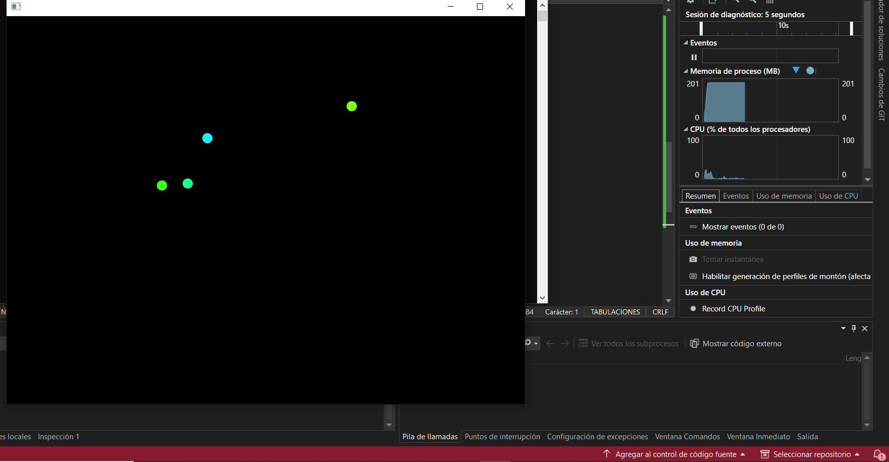

 con ver el código y ejecutarlo, puedo ver que se crea una clase padre partícula, que es una clase abstracta, por lo que debe impementarse en cada hijo, luego esta la rising particle, que es una particula, y se le indica un tiempo de vida, un estado de si explotó o no, dimensiones, y el espacio del que salen, tabmién hay una clase base para las explosiones, que se implementa luego como tipos de explosión.

# Actividad 3#

 Viendo el código podría predecir que el objeto esté en el stack, sin embargo las partículas no, que además son punteros y son solo la dirección de memoria, entonces deberían estar en el heap.
 
 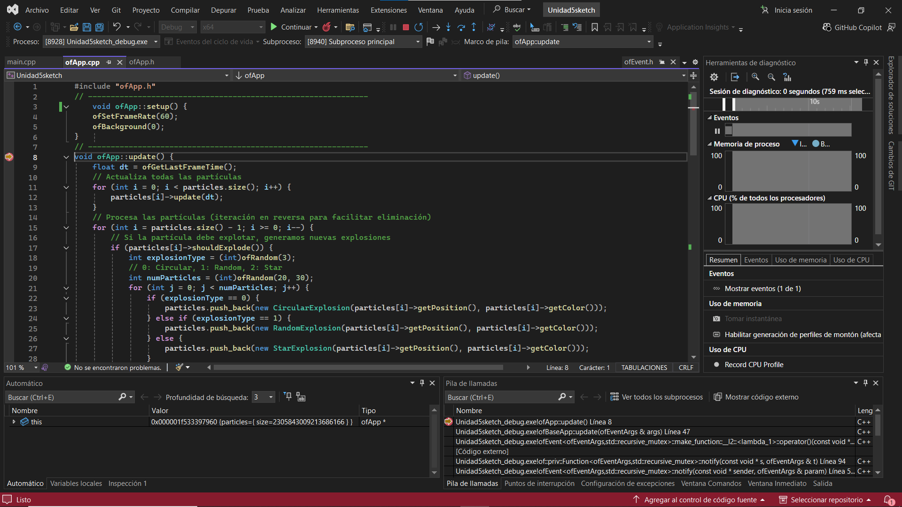
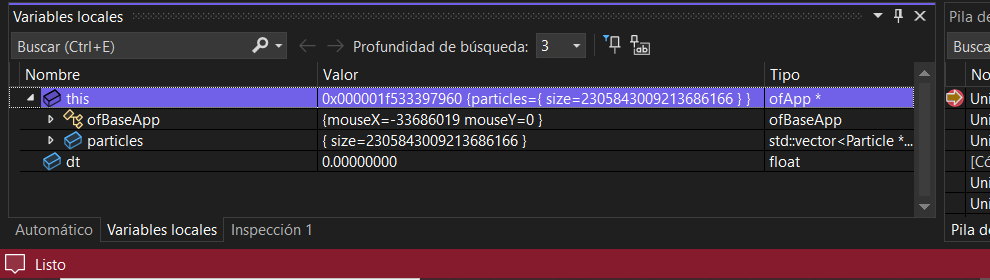

Si inspeccionamos this, que es el puntero que apunta a la clase of app, podemos encontrar el vector de partículas, cómo es un objeto dinámico, sólo está en memoria mientras corre el programa.

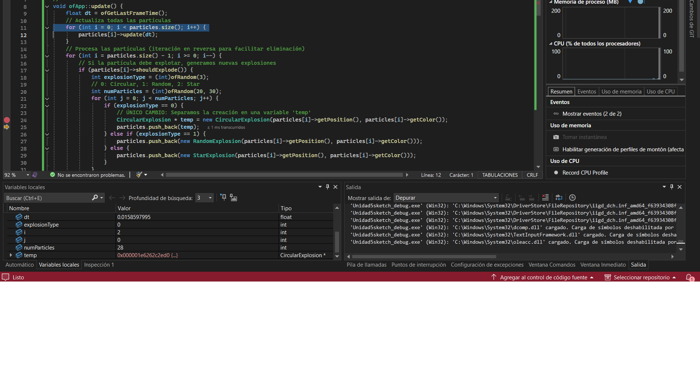

Al rastrear explosión circular en la memoria agregandole un puntero temporal temp podemos encontrar su dirección e inspeccionar memory 1 para ver todas las partes que componen el objeto

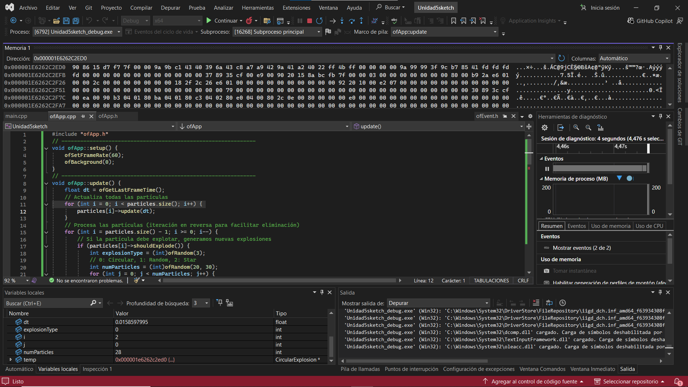

nuevamente vemos como el objeto es un bloque contiguo de bytes, y en memoria podemos ver que se ordenan dependiendo de la herarquía, primero sería la vtable, que contiene ínformación de la base de lo que requiere el programa, cuando llamas a *particulas, el programa no sabe si se consulta una risingparticle o una explosión, por lo que el programa mira la información de la vtable y este lo lleva a circular explosion para sacar la función draw correcta.

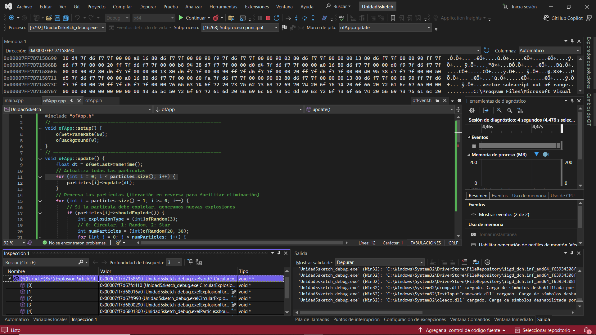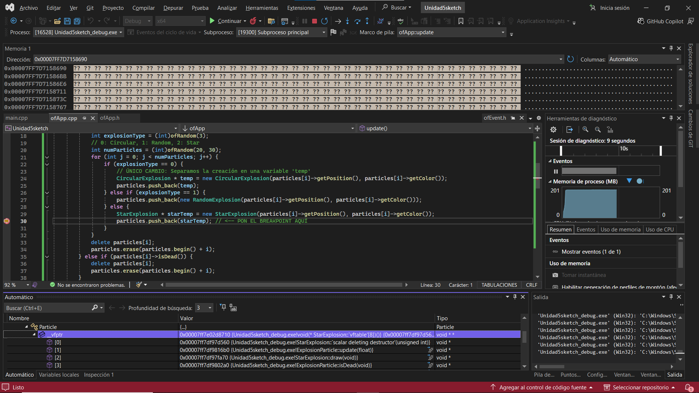

si comparamos las tablas podemos evidenciar que ambas son distintas, pese a que ambas tienen un método draw, las direcciones son distintas, ya que es un método polimórfico que se implementa distinto en cada clase, ambas tienen la misma estructura porque heredan la misma base.

los métodos virtuales son una instrucción que indica, cuando son llamados, que no debe decidirse que función implementar en ese momento, y se deja el espacio para que se aplique el método correcto durante la ejecución.  

Con base a lo que hemos visto, la tabla de funciones virtuales puede servir para que el polimorfismo sea posible, ya que deja ese espacio dinámico.

# Actividad 4#

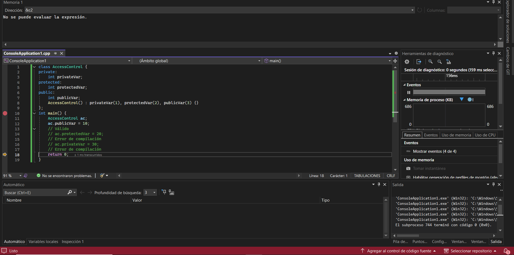

al descomentar obtengo un error de compilación ya que estamos intentando acceder a funciones protegidas.

en el otro ejemplo volvemos a obtener un error de ocmpilación ya que nuevamente intenta acceder a datos privados sin ser un hijo.

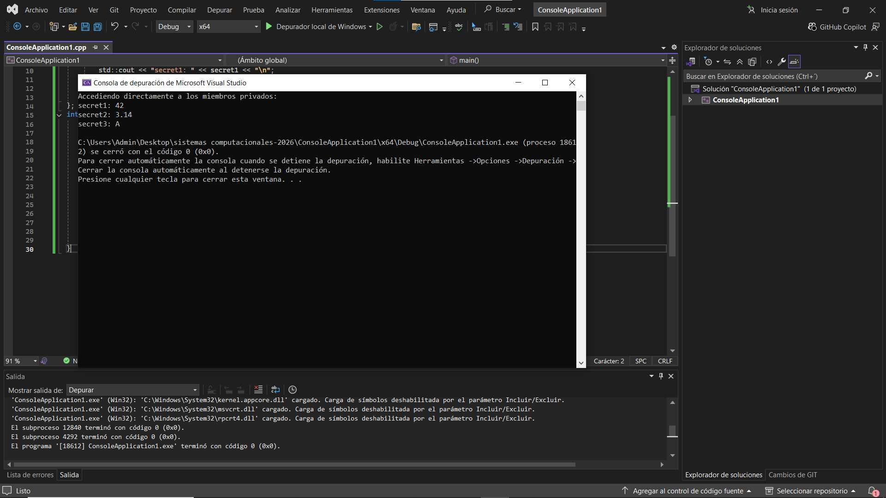

En este código estamos violando el encapsulamiento con reinterpret cast, pero normalmente no se podría acceder a esos datos privados, el encapsulamiento es importante por el manejo de vvariables en códigos largos, para no tener que cambiar todo 1 por 1, sino que todo lo que acceda lo haga de manera segura.

# Actividad 5#

al inspeccionar circular explosion puedo evidenciar que el objeto esta construido por capas de datos, que nacen del puntero vtable, que indica de donde tomar la información correctamente.

También notamos que antes de ejecutar el código hijo, los valores de la clase padre ya están asignaddos en su propio constructor, y que x y y ya tienen valores antes de calcular la velocidad.

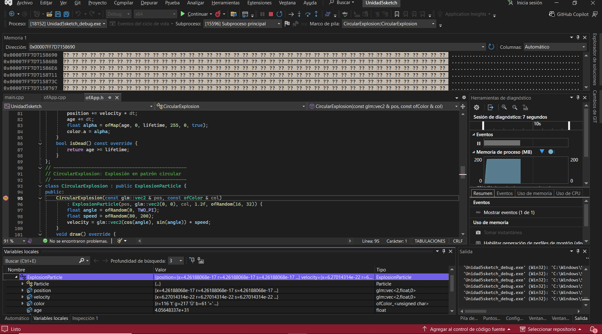
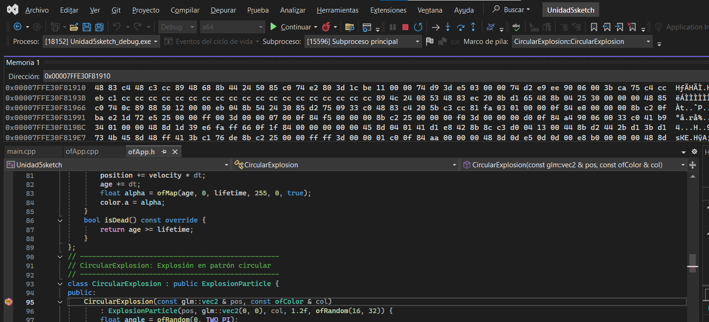

las clases padre, y lo que componen el objeto estan todos ubicados de manera contigua en un bloque de memoria, el depurador nos permite ver las clases padre que componen el objeto en ese momento. que se acumulan hasta el momento.

la herencia en c++ funciona a nivel de memoria, reservando el espacio en memoria necesario para toda la jerarquía cuando se inicializa el objeto, las instrucciones están dadas por la vtable, que ayuda a aplicar el polimorfismo.

Para la realización del exprimento me tuve que apoyar de la IA, ya que no me encuentro tan familiarizado con c++ y no se me ocurre como podría cumplir los rquisitos de manera eficiente.

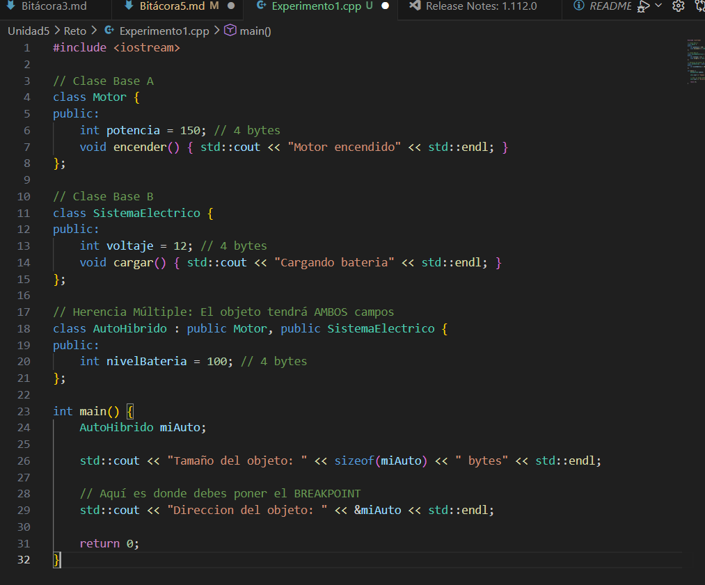

aquí podemos ver como se crean 2 clases con atributos propios como potencia y voltaje, y luego una clase híbrida que hereda ambas clases motor y sistéma eléctrico, y luego se puede utilizar en el main, ocupará el espacio en memoria de ambas clases padre

# Actividad 6#

Cuando analizamos el código y utilizamos el depurador

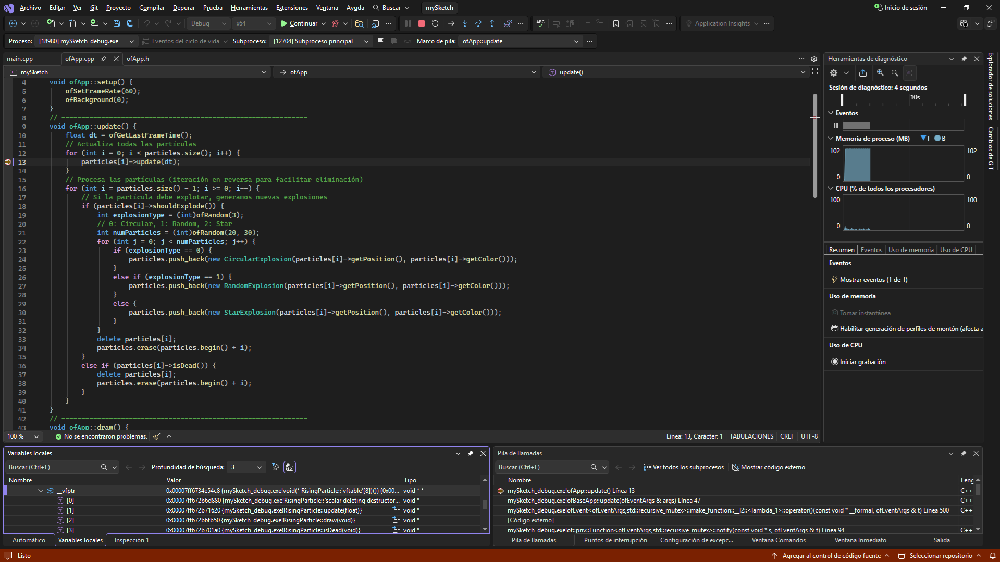

podemos ver que aunque estamos analizando particle, estaamos viendo el objeto real rising particle, si desplegamos la herencia podemos ver cómo se aplica el polimorfismo con una clase abstracta, al presionar f11, no nos llevará a la clase padre, sino a su implementación específica que obligatoriamente debe estar implmementada, es un metodo virtual

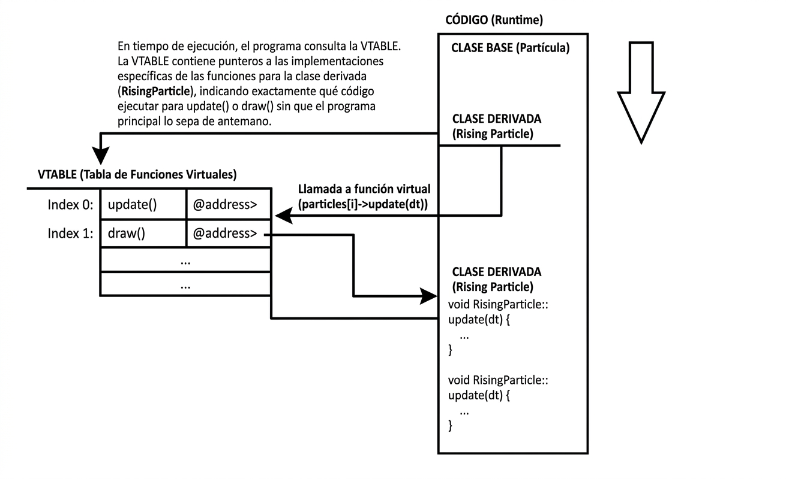

la relación entre el polimorfismo y los métodos virtuales es directa, los métodos virtuales son una manera que tenemos para aplicar el polimorfismo, con ellos le decimos al compilador que cuando se instancia un hijo del objeto, el método debe ser implementado específicamente para ese hijo, y que debe revisar cómo se hace en cierta dirección en el código.

# Actividad 7# 

Para la actividad 7 debía agregar 2 nuevos tipos de partículas a rising particles, escogí una que se moviera de manera curva, y otra que se moviera de manera erratica, tenía bastante claro como implementar nuevas partículas, y sólo me apoyé de la IA para el código de la driftingparticle, ya que utilizaba una funcion que no conocía

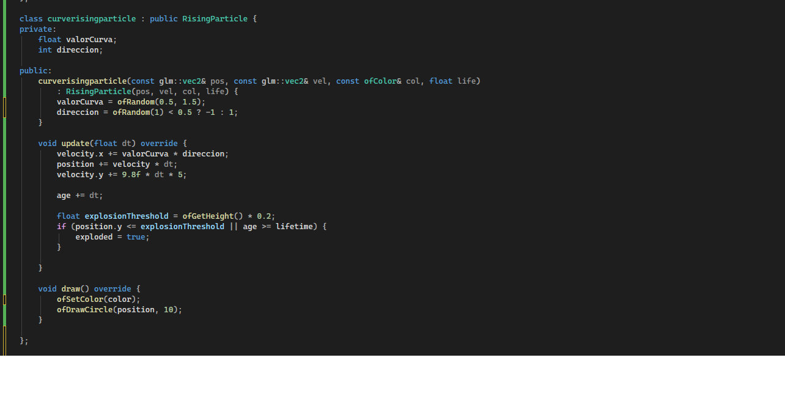
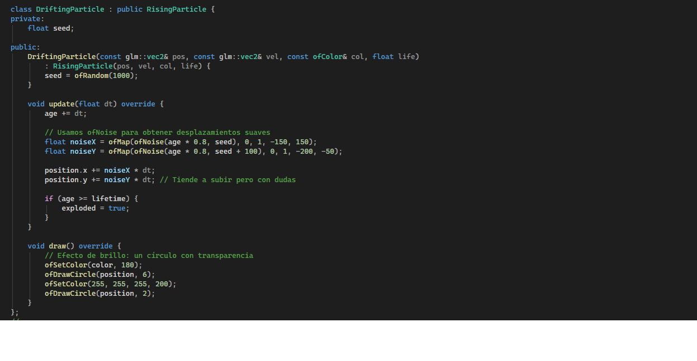

Aquí estamos utilizando distintos conceptos que vimos durante la unidad, al crear clases nuevas que son rising particles, estamos utilizando la herencia, por eso luego no tenemos que reimplementar todas las funciones en las nuevas particulas, ya que se encuentran en la clase padre rising particle, tambén vemos el encapsulamiento, en la manera en la que manejamos información privada y pública dentro de nuestras clases y así decidimos quienes y cómo pueden acceder a esa información, y el polimorfismo en la manera en la que cuando llamamos en el update a las particulas, el programa sabe a cual debe ir y actualizar dentro del código, así sean particulas distintas.

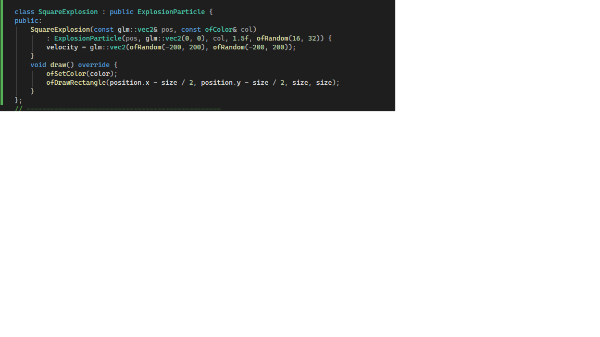

también agregué una explosión con cuadrados, fue bastante sencillo, y para hacer todo funcionar, al final tuve que realizar los cambios correspondientes en el ofApp.cpp para que tuvieran en cuenta las clases nuevas en al generación aleatoria de los objetos.

para verificar la correcta aplicación de estos principios utilizamos el depurador

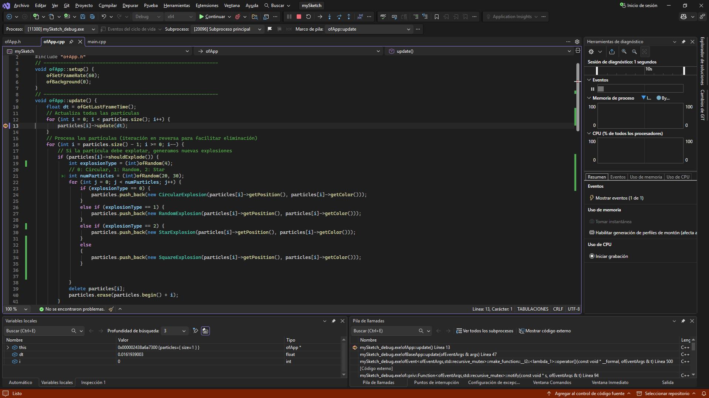
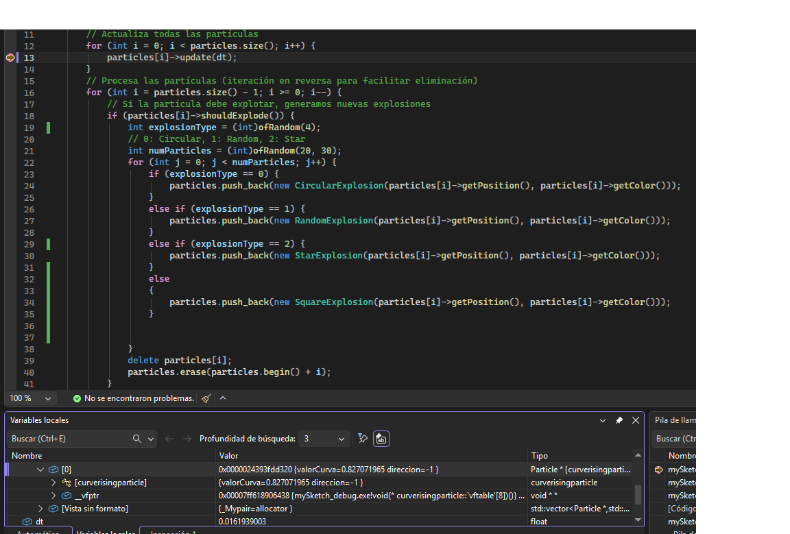

Aunque el puntero es de tipo particles, este señala el tipo de particula que se generó en este caso como objeto especializado, y en cada iteración mostrará uno distinto, esto muestra que los principios, en especial el polimorfismo estan bien aplicados, pero también la herencia y el encapsulamiento lo hacen posible.

# Evaluación, consolidación y cierre#

abordar esta unidad fue un desafío porque aunque entendía los conceptos de la POO, no los tenía tan afianzados, y así mismo no estoy acostumbrado al uso del depurador, siento que realizar los ejercicios fue fácil, sin embargo lento y lleno de información util, que me ayudó a entender la utilización detrás del telón de todos estos principios siento que lo valioso de trabajar con c++ es que realmente te hace entender el manejo y los procesos en memoria como nada más lo hace, y esto te ayuda a entender fundamentalmente los conceptos tratados, más que principios, su funcionamiento.

siento que tuve un buen desempeño dentro de la unidad, no me perdí mucho, y en momentos de bloqueo supe apoyarme de las herramientas a mi disposición, más que para obtener un resultado, para entender que me faltaba y como hacerlo bien.

siento que mi documetnación fue detallada, y pude demostrarle al profe mi entendimiento de los conceptos, por lo que mi autocalificación sería un 5.

para cerrar tengo como conclusiones que si quieres tener un codigo optimizado y seguro debes tener siempre claros los conceptos de POO, y de manejo de memoria, incluso cuando no estás trabajando en un lenguaje de alto nivel, porque esto hace en últimas, el códgio más fácil de trabajar y editar en un futuro.