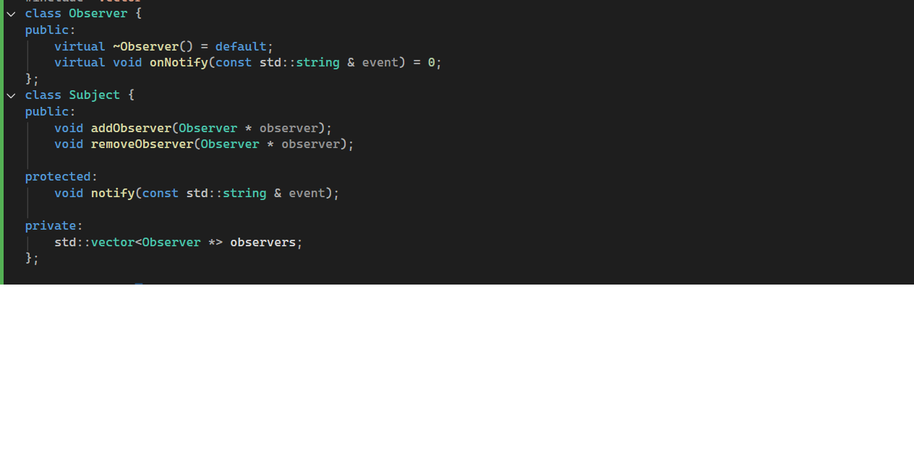
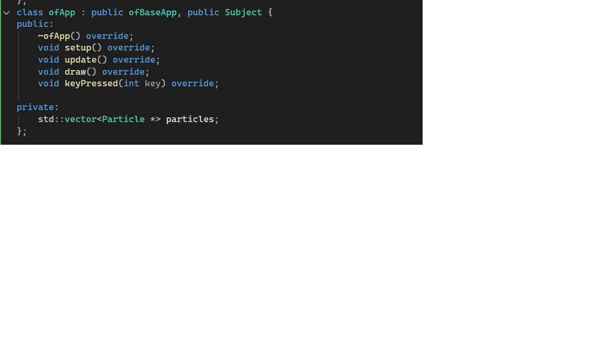

# Actividad 1#

Tras ejecutar la aplicación podemos evidenciar las funciones de las teclas, las asocie como A atract, R repulse, S static, n New o neutral. Lo que me imagino que sucede detrás de camaras, por así decirlo, es que las partículas tienen un comportamiento predeterminado, y hay una clase partícula que tiene muchas instancias, cada vez que presionas una de las teclas, estás alterando el comportamiento de todas las partículas,  A y R con respecto al mouse, y las otras 2 como acciones generales.

# Actividad 2#

Estudiando el patrón de diseño observer, podría asumir de entrada que el subject es el mouse o las partículas, pero aún no sé cual, puesto que el comportamiento de las partículas depende del mouse solo en 2 de las funciones, y en las otras son comportamientos propios, entonces deberé ahondar más para descubrirlo.

si el mouse fuera el publisher, y las partículas subcribers, se podría llamar el metodo de atraer o repeler esos subcriptores, supongo también que desde el publicador se les puede indicar tambien que resuman el comportamiento erratico o que pasen a un estado estático, pero debo seguir ahondando.

otra hipótesis en el camino es que el publisher no les dice que hacer, sino que les notifica de su estado, y luego las partículas podrían consultar ese estado para decidir que hacer, esto ayudaría a mejorar el código ya que cada partícula puede taner un comportamiento distinto sin tener que indicarle individualmente que hacer.

Ahora mis reflexiones tras analizar el código:

La clase que actúa como al interfaz del observer es observer y define el método virtual onNotify(const std::string & event)

el subject sería la clase subject y tiene los métodos de gestión add y remove observers, y para notificar recorre el método onNotify de cada uno de los observers

El concrete subject sería OfApp ya que hereda la clase subject, envía las notificaciónes invocando notify en el método keypressed
 
  

y el concreteobserver serían las partículas, que reaccionan al estado de la notificación para cambiar su propio estado, al manejar estados también permitimos que no haya que dejar undido el botón sino que hasta que no presione otro no habrá cambios en el comportamiento