# Actividad 1#

Tras ejecutar la aplicación podemos evidenciar las funciones de las teclas, las asocie como A atract, R repulse, S static, n New o neutral. Lo que me imagino que sucede detrás de camaras, por así decirlo, es que las partículas tienen un comportamiento predeterminado, y hay una clase partícula que tiene muchas instancias, cada vez que presionas una de las teclas, estás alterando el comportamiento de todas las partículas,  A y R con respecto al mouse, y las otras 2 como acciones generales.

# Actividad 2#

Estudiando el patrón de diseño observer, podría asumir de entrada que el subject es el mouse o las partículas, pero aún no sé cual, puesto que el comportamiento de las partículas depende del mouse solo en 2 de las funciones, y en las otras son comportamientos propios, entonces deberé ahondar más para descubrirlo.

si el mouse fuera el publisher, y las partículas subcribers, se podría llamar el metodo de atraer o repeler esos subcriptores, supongo también que desde el publicador se les puede indicar tambien que resuman el comportamiento erratico o que pasen a un estado estático, pero debo seguir ahondando.

otra hipótesis en el camino es que el publisher no les dice que hacer, sino que les notifica de su estado, y luego las partículas podrían consultar ese estado para decidir que hacer, esto ayudaría a mejorar el código ya que cada partícula puede taner un comportamiento distinto sin tener que indicarle individualmente que hacer.

Ahora mis reflexiones tras analizar el código:

La clase que actúa como al interfaz del observer es observer y define el método virtual onNotify(const std::string & event)

el subject sería la clase subject y tiene los métodos de gestión add y remove observers, y para notificar recorre el método onNotify de cada uno de los observers

El concrete subject sería OfApp ya que hereda la clase subject, envía las notificaciónes invocando notify en el método keypressed
 
  

y el concreteobserver serían las partículas, que reaccionan al estado de la notificación para cambiar su propio estado, al manejar estados también permitimos que no haya que dejar undido el botón sino que hasta que no presione otro no habrá cambios en el comportamiento

Al presionar la tecla A, en el método keypressed podemos ver que se llama un metodo llamado notify, y lo que hace este método es recorrer todos los elementos que se encuentran almacenados en el vector observer, y ejecuta su metodo Onnotify pasándole el código attract, y a su vez, el método OnNotify, al recibir el evento attract ejecuta la linea setstate, y cambia el estado de los observers a ser atraidos por el mouse.

- registro y eliminación de observadores
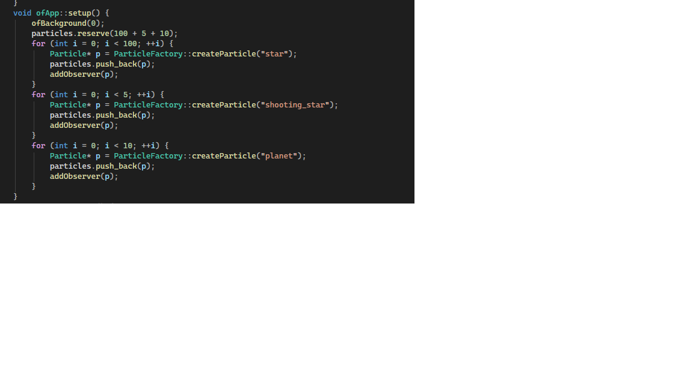

En estas líneas vemos el momento en el que se añaden los observadores en la creación de las partículas, si tuviera que destuirlos durante el tiempo de ejecución del código tendría que llamar a removeObserver antes de hacer el delete de la partícula, el destructor de offApp es importante para evitar memory leaks, ya que estamos llamando partículas con new, y deben ser eliminadas cuando no se necesiten más, y también para evitar punteros colgantes.

- El patrón observer resuelve el problema, en caso de necesitarlo, de  tener muchos objetos con comportamientos dependientes a algo, y en vez de tener que hacer que estos consulten el estado de ese "observado" constantemente, los objetos mantendran un estado hasta notificados de un cambio mediante un mecanismo de publicación.

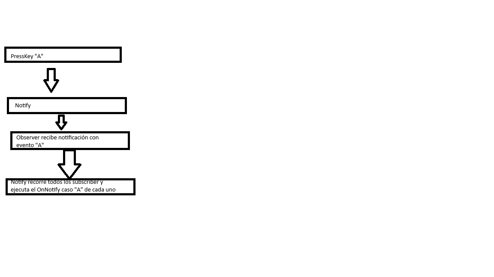
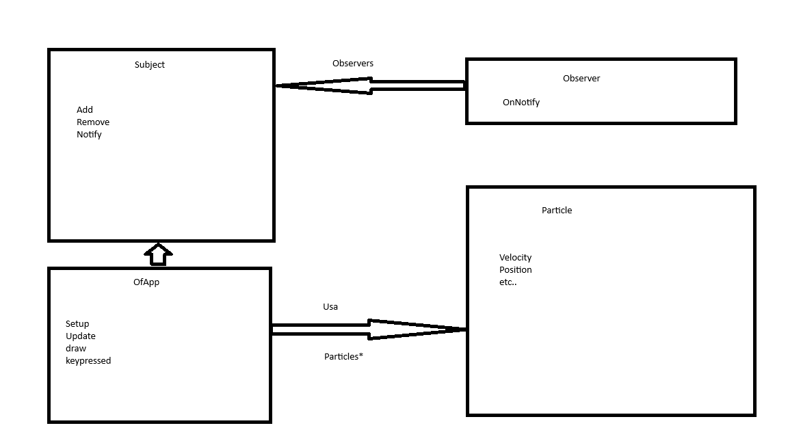

- Utilizar el patrón observer tiene muchas ventajas a nivel de mantenibilidad ya que, estas ahorrando recursos al no consultar en el update constantemente los estados, no tienes que poner las particles en ofApp ya que solo necesita saber que existen los observers. Otra razón sería para implementar el encapsulamiento, las variables globales pueden ser accedidas por todo el código, mientras que con el observer manejas recursos privados. Y a la hora de extender el código no tiene que tocar ofApp, solo necesitas que las nuevas clases hereden el observer y añadirlas como observadoras.

# Actividad 3#

Ahora vamos a analizar el patrón de Factory method, que nos ahorra el trabajo de esparcir código de creación por todas partes, tenemos una clase con un método, o una factory como una interfaz para crear objetos, que las clases pueden heredar e implementar como necesiten.

1.La factory en este caso es ParticleFactory y el metodo factory es CreateParticle y es un método estático y devuelve un puntero particle*
2. Utiliza unos if/else que comparan el string recibido, necesita recibir un string del tipo de particula específico que debe crear,  y si recibe un tipo de partícula desconocido, crea una partícula por defecto que existe en el constructor de particle, y new particle() ocurre al inicio independientemente del método, para mejorar esto creo que sería mejor manejar exepciones y notificar que no es una partícula válida.

3. se utiliza dentro de bucles for, en lugar de configurar manualmente cada propiedad, le píde a la fábrica el objeto terminado y lo almacena en vector añadiendolo como observador

así debería implementarse cada partícula sin usar una factory.

El problema principal que aborda el método factory es el de la implementación de nuevos métodos al código sin la necesidad de alterar todo el sistema, utilizando nos aseguramos de que en el momento que necesitemos implementar algo, vamos a tener una interfaz que lo cree en vez de tener que utilizar código de creación cada vez.

el factory aporta muchas ventajas, pues habilita el SRP haciendo que ofApp no tenga que instanciar las partículas, sino que delega la creación, también facilita la expansión del código, no tienes que buscar donde se crea cada cosa, sino que sabes que hay una interfaz de creación.

si queremos añadir un black_hole, debemos añadir otro else a la factory con el tipo nuevo de partícula, luego debemos crear sus propiedades en ese mismo bloque y con esto solo quedaría llamarlo cuando lo necesites, y sólo habría que modificar el OfApp para determinar cuantas partículas y cuando crearlas.

si decides utilizar un método instancia tendrías que crear la instancia, mientras que como está solo debes llamar a la factory y pasarle el string, sin embargo tendría ventajas como el manejo de variables internas y estado propio que no facilitaría el método estático, añade un poco de complejidad, pero puede escalarse más.

# Actividad 4#

Finalmente repasaremos el método state, El patrón State permite a un objeto encapsular diferentes comportamientos (estados) en objetos separados y delegar la ejecución a su objeto de estado actual. Esto evita tener grandes bloques if/else o switch en la clase principal para manejar el comportamiento dependiente del estado.

context en nuestro código sería particle, y el miembro que utiliza para mantener estado actual es el puntero state* que se definió de manera privada.

la interfaz sería la clase abstracta state

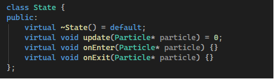

las clases concretestate serían las opciones de interacción con las teclas a,r,n,s que determinan los comportamientos de las partículas

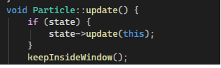

el método delega la lógica de actualización con el state->update(this), le dice al estado que tome la referencia y la actualice en su contexto.

cada una de las clases concretestate tiene su propia implementación y fórmula
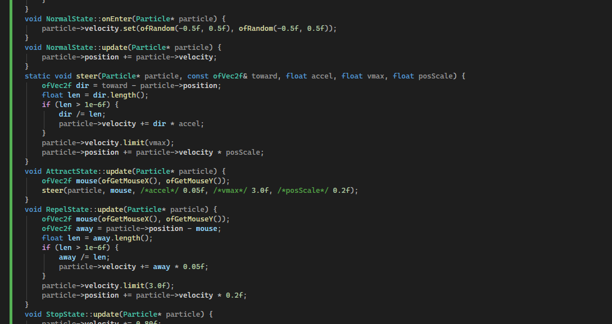

3. la partícula cambia de estado cuando recibe una notificación a con OnNotify, el método que hace esto es SetState

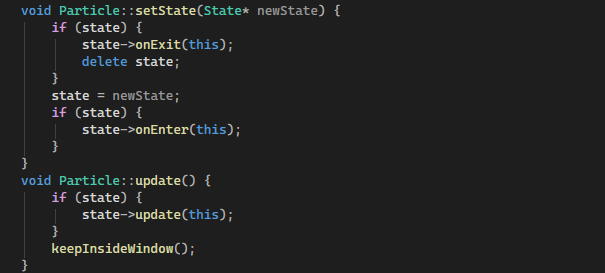

Esto lo que hace es verificar si existe un estado previos, si existe llama a state onExit(this) y borra el estado y luego asigna el estado nuevo llamando onEnted(this), son importantes porque nos permiten configurar las partículas una vez en su cambio de estado, y no en cada frame.

El evento que desencadena el cambio de estados es presionar una tecla

Reporte:

1. El patrón state nos permite regular un programa declarando estados por los que puede transitar, y podemos crear reglas para estos estados, en cohesión con el observer y el factory permite realizar un codigo robusto y confiable, la ciencia detrás del método state se basa en las máquinas con estados finitos, sin embargo las máquinas de estados finitos con muchos estados empiezan a volverse complejas de entender, manejar y ampliar, y el metodo state nos entrega una solución a esto creando una interfaz a la cual el contexto puede delegar el trabajo de cambiar estados.

2. 
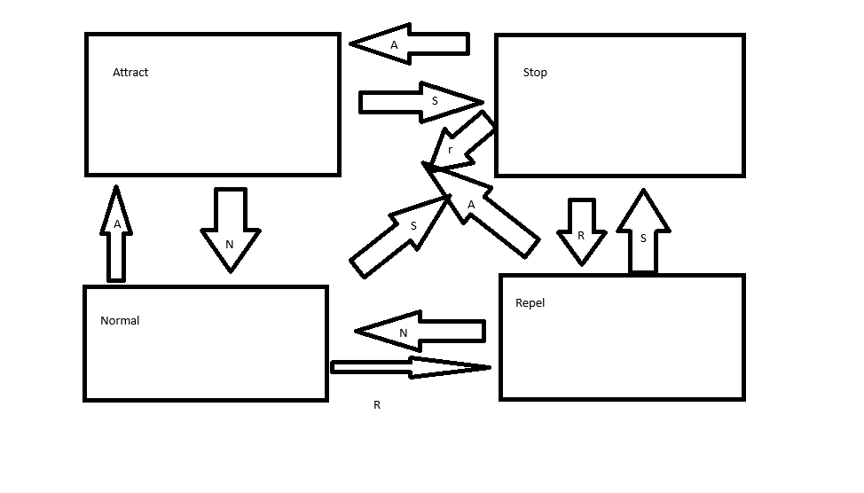

3. utilizar el patrón state en este caso nos evita varios problemas, primero en legibilidad del código pues no tenemos muchos condicionales complicados en una clase y no es tan díficil de mantener, ya que un fallo en la lógica de un estado, puede dañar la de otro estado, en cambio si cada estado es su propia clase con su lógica de draw encapsulada y si necesitas cambiar su comportamiento solo debes modificar esa clase. En términos de extensibilidad también es muy efectivo, pues no tenemos que ir a buscar cáda parte del codigo donde haya un condicional con ese estado, sólo debes crear una nueva clase que herede el estado base y la hora de hacer transiciones el método state nos ahorra tener que manejar variables booleanas para ejecutar codigo una sola vez, sino que manejas los métodos OnEnter y OnExit para manejar la memoria y evitar desbordamientos y mal uso, el destructor se llama automáticamente al cambiar de estado.

4. OnEnter se encarga de definir comportamientos antes de la ejecución del update, nos evita tener que verificar o aplicar comportamientos cada frame. y el OnExit nos ayuda a mantener el orden y gestionar memoria, deja la partícula lista para entrar a un nuevo estado.

En OnEnter attract state podrían declararse más comportamientos, por ejemplo un cambio de tamaño, posición o color a las partículas atraídas.

En OnExit Stop, podrías revertir a los valores base de las partículas para prepararlas a un cambio de estado, o incluso generar un color o sonido que indiquen que se salió del estado.

# Actividad 5#
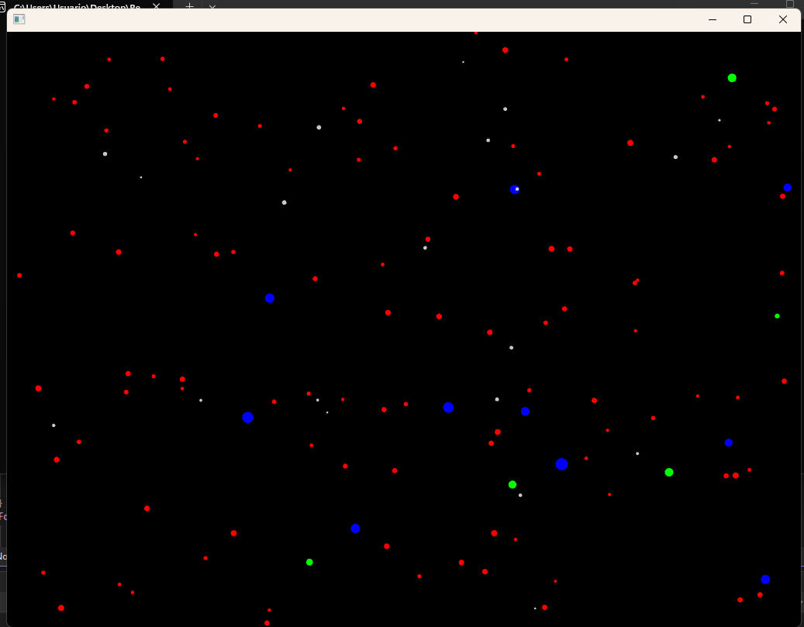

Para la actividad 5 en un principio pensé en agregar una estrella que titilara, sin embargo, pronto me encontré con las limitaciones de este sistema, si bien es fácil agregar nuevos tipos de partículas, sus comportamientos están sujetos a los parámetros establecidos por la factory, si quisiera poder hacer que titilaran debería añadir un método virtual e implementarlo con cáda partícula en su creación, o crear una subclase solo para la partícula que titila.

Al notar esto, decidí crear una partícula tipo "moon", y fue bastante sencillo, solo hay que añadir el nuevo tipo al particle factory con sus parámetros, y configurarla en el setup

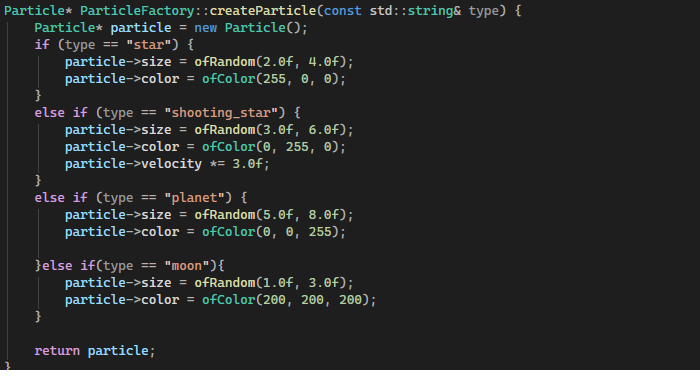
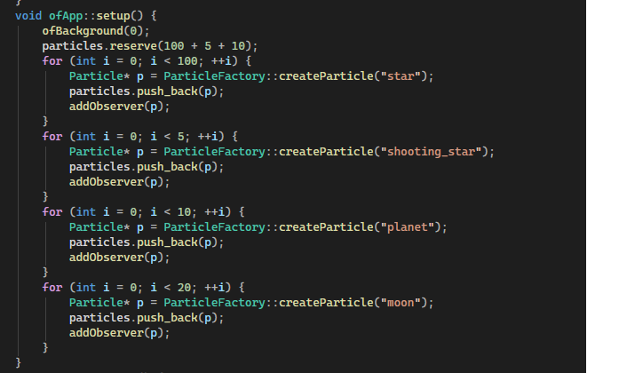

Estos simple cambios entran en contacto con los principios vistos anteriormente, estos hacen posible que estos cambios sean tan sencillos.

- primero utilizamos la factory para definir los parametros de "moon", como su tamaño y su color sin tener que ponerlos en OfApp, sino solo pasando el string moon.

-Luego, en el setup añadimos las partículas moon como observers, esto hace que sean subscriptoras del subject y pueden alterar su comportamiento mediante OnNotify

-finalmente entra dentro del flujo de trabajo del patrón state, al ser un observador concreto, al momento que reciba la notificación de que debe cambiar de estado, cambiará su comportamiento, sin tener que implementarlo en la partícula específica, sino por un sistema de estados construido con el patrón state.

El código fuente se encuentra en la carpeta de investigación de esta unidad.

# Autoevaluación#

Nota propuesta: 5

Siento que me merezco un 5 en la bitácora de esta unidad ya que tengo las 5 actividades completas y siento que entendí completamente el tema, esto en la bitácora, ya que soy consciente de que mi asistencia dejó que desear.

Esta unidad me trajo sopresas, es el primer tema que vemos del cual no tenía ni siquiera una noción y debo decir que fue bastante interesante, realmente son cosas que me gustaría aplicar a mis proyectos y códigos, ya que solucionan muchos problemas de no tener un código ordenado, y limitarse a uno mismo con la implementación inicial.

Siento que mi desarrollo de esta unidad fue bueno, no necesité apoyarme de la IA, con la información de refactory gurú y la unidad fue más que suficiente, me interesó mucho ver la interacción de estos patrones de diseño funcionando en conjunto en un mismo código, y cómo se habilitan mutuamente.

Tengo una bitácora completa con imágenes de prueba y buen entendimiento del tema.

