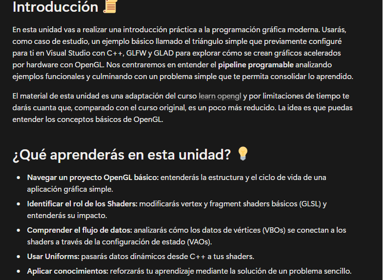
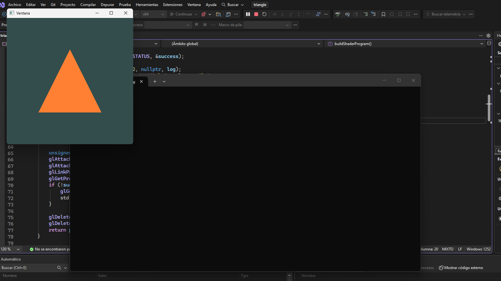
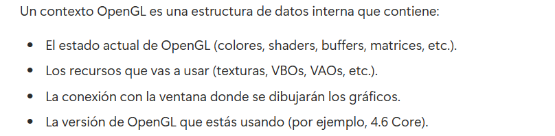
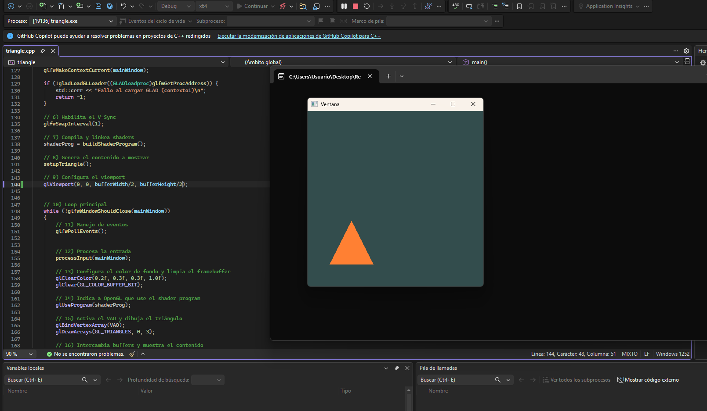
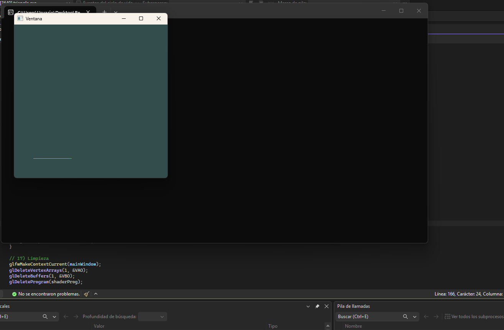
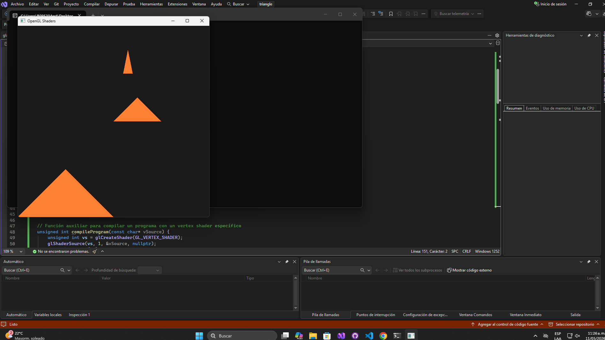
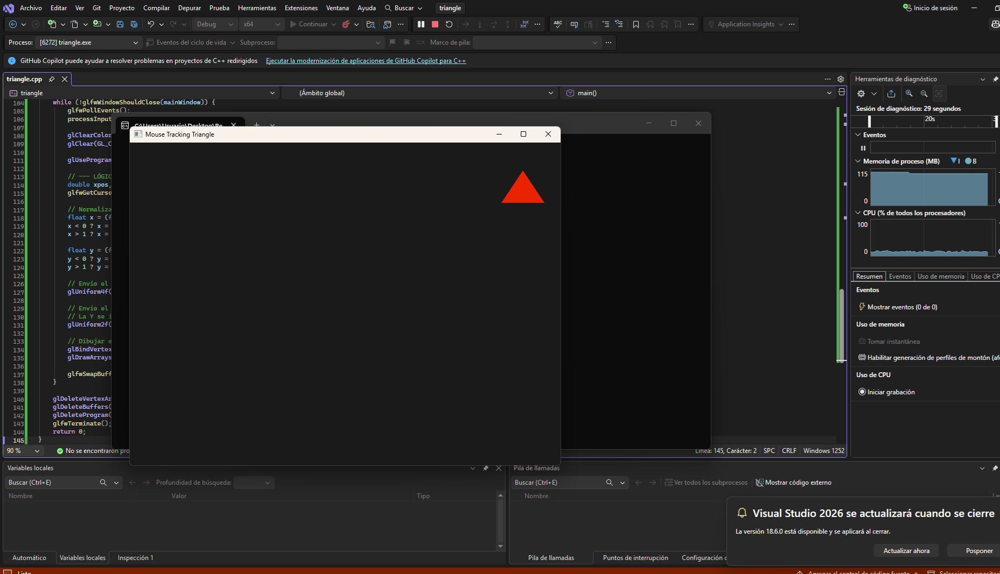
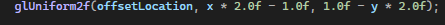
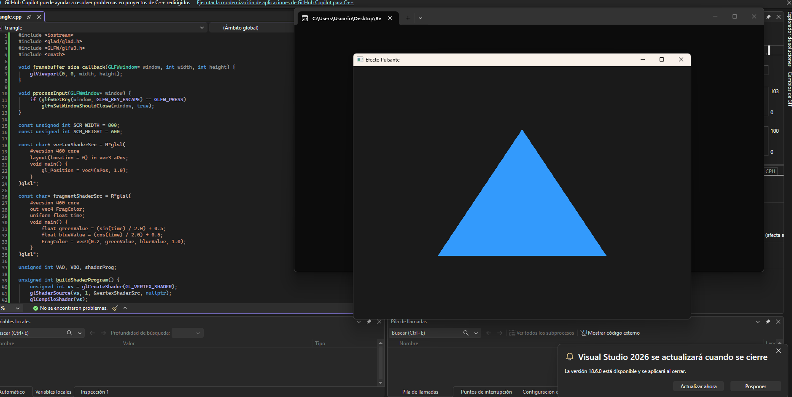

# unidad 7

# Actividad 1

En esta activiadd importamos un proyecto nuevo de OpenGl que simplemente genera un triángulo, su funcionalidad es sencilla, sin embargo, el código aún no es muy claro para mi

pareciera que no estás utilizando recursos nativos, sino que los consultaras en una librería o en un servidor, ya que tienes un manejo de errores por si fallan los shaders, esa es una cosa que me gustaría ahondar más, como también las definiciones de VAO y VBO, y que es un buffer.

# Actividad 2

mi entendimiento de esta actividad es bueno, aunque fue un poco complejo seguir el paso a paso de la creación del proyecto, para crear un proyecto con un motor gráfico necesitamos ciertas librerías que no son nativas de visual studio, y que hacen posible la ejecución y compilación del código.

Está la librería de opengl, que hace posible que se compile el código, crea el contexto inicial,

Está GLFW, que funciona como una librería estandarizada para crear ventanas, manejar inputs y gestionar lo que crea la librería de opengl, esto sería el contexto.

Está Glad, que resuelve los problemas de la librería de opengl, ya que está desactualizada y no cuenta con todas las funciones, glad consulta estas funciones directamente en el dirver de la GPU donde están implementadas.

y GLM que es una bilioteca de operaciones matemáticas que nos pueden servir para gráficos o animaciones.

# Actividad 3

en esta actividad estamos analizando el pipeline de opengl, vimos la analogía del artista que necesita un estudio para poder crear, opengl es el artista, y GLFW es quien crea el estudio, para nosotros el contexto, ya que opengl siempre necesita un contexto dedicado para poder funcionar

tambien vemos como funciona el viewport que se configura con respecto al tamaño del framebuffer para que opengl dibuje lo que se le pide en ese espacio, si se llega a alterar la relación del framebuffer y el viewport se puede desconfigurar el output como se ve en la siguiente imagen.

honestamente tras la ayuda sugiriendo experimentar con los tamaños del buffer, no se me ocurre mucho que pasaría si, quizás que pasaría si se asignararn distintos viewport al mismo render, pero tampoco se implementarlo para probarlo entonces me guardaré la pregunta para clase.

cambiando el parámetro de gldrawarrays podemos cambiar las indicaciones de que debe dibujar

por ejemplo con GL_Lines obtenemos esto.

si camias el 3er parámetro a 2 desaparece y a 4 vuelve a aparecer, acá se confiuguran los tipos de primitivas que utilizan para dibujar opengl.

## Reporte

1. El contexto OpenGL es un sistéma de código donde se almacena la información necesaria para el funcionamiento de OpenGl. Guarda texturas, buffers, shaders.

2. El rol de la la biblioteca glfw es indicarle a opengl como debe leer el teclado, el mouse, crea el contexto del opengl

3. es como si el contexto brindara el espacio y los materiales al artista para crear, es el espacio que habita y con el que interactúa cuando crea.

4. el frame buffer es una coleccion de mapas de bits, es donde se genera la imagen del output, me recuerda un poco a las tablas virtuales

5. el viewport es la parte del framebuffer que será utilizada por opengl para el dibujo.

6. la Gpu es donde ocurren los gráficos, actúa como ALU, y los drivers son lo que le traduce el código como indicaciones para trabajar.

7. el vsync sincroniza la velocidad de fotográmas con la tasa de refresco de la pantalla.  

Si no lo activas y la imagen es estática vas a pedirle mucho esfuerzo a la gpu cuando no lo necesita, pues intentará rendereizar la imagen sin parar. aunque reducuiría el input lag. Y si es dinámica, solo se verá como intenta dibujar 2 frames al tiempo glitcheando el movimiento.

8. el legacy era mucho más ineficiente pues maejaba instrucciones individuales, mientras que el moderno trabaja en base de shaders que se procesan muy rapido en la gpu.

9.  el shader program es el ejecutable final, es el cerebro que procesa los numeros en la gpu.

10.  pone los datos del triángulo dentro del contexto. el VBO es el almacén de datos de la gpu, y VAO guarda la configuración.

11. En este caso no es necesario pues sólo tienes un objeto, y si lo activas antes del loop Opengl guarda la configuración, pero si tuvieras múltiples objetos en cada iteración liberas el Vao y setteas uno nuevo.

12. swapbuffers ocurre porque opengl maneja 2 buffers, el que se muestra en pantalla y el que dibuja en segundo plano, swapbuffers intercambia estos búfers y te muestra la imagen, sin él te quedarías con el color inicial.

# Actividad 4

La cpu y la gpu pueden en últimas realizar procesos similares, la direrencia reside en la manera en la que se procesa esa lógica, en una cpu es secuencial y en una gpu es simultánea.

Los pasos claves del pipeline
1. vertex processing que se encarga de cargar los vertices.

2. rastetización: es como se decide esos vectores en que pixeles aparecerán.

3. fragment processing: aplicar las texturas y colores.

El pipeline programable significa que, mediante los shaders, el programador puede decidir como se colorean los pixeles, en el legacy, la gpu tenía funciones predefinidas, tu solo las prendías y apagabas.

la ventaja de esto es la posibilidad que otorga para hacer distintas cosas con esos píxeles, es mucha más flexibilidad y espacio a la creatividad del público para mejorar la experiencia.

Necesitas programar el vertex shader y el fragment shader

# 3
rasterización: es el proceso mediante el cual se toman los vectores y se arreglan en una rejilla de fragmentos.

# 4 

El fragmento es la información que compone el pixel, el pixel es el punto en la pantalla.

# 5

el Z-buffer se utiliza para resolver un problema con los píxeles, ya que al tener muchos vértices en una escena 3d por ejemplo, hay cosas que pueden estar más atrás que otras, el z-buffer le añade la dimensión de la profundidad a los píxles para indicar donde están y que la cámara solo vea lo que está al frente. El depth test utiliza el depth buffer para verificar que está adelante y que está atras comparando las coordenadas en Z.

# 6 

el antialiasing surje del problema de que por ejemplo, renderizas un triángulo, pero la línea de este triangulo pasa por la mitad de un pixel, el pixel entero será pintado con el color del triángulo, resultando en bordes pixelados o parpadeos. El antialiasing marca 16 puntos a través del píxel, para determinar como pintar ese píxel dependiendo de la cantidad de esos 16 puntos cubierta por el triángulo.

# 7 

El fragment shader se encarga de sombrear cada píxel teniendo en cuenta la iluminación, cada fragmento cambia el tono de su colo dependiendo de si la normal está mirando hacia una fuente de luz o no. Es posible hacer un shader sin iluminación, esto mejoraría el rendimiento del programa y esto también se vería refljeado en gráficos más simples.

# 8

múltiples fuentes de iluminación implican más trabajo para la gpu, un cálculo más largo y más complejo, por lo que normalmente se limita el numero de luces que influyen en el shader, así haya más se limita a ciertas luces por temas de rendimiento.

# Actividad 5

La normalización de las coordenadas del mouse se hace convirtiendo las coordenadas en la pantalla a un número con valor de 0 a 1, se logra dividiendo la posición actual del cursor por el tamaño de la pantalla, se relaciona con opengl porque este último no entiende la información del pixel directamente, necesita unos valores relativos para que el sistema de coordenadas de dispositiivo pueda trabajar más fácilmente.

El NDC es el sistema de coordenadas interno de opengl, donde el sentro de la pantalla es 0,0 y los bordes van de -1 a 1, 

 

 esta línea convierte el valor que obtenemos de la normalización del mouse a una coordenada valida para el NDC.

 # Actividad 6

 

 para lograrlo utilizamos la funcion glfwgettime dentro del bucle principal, esto nos devuelve el tiempo transcurrido desde que se inició la librería, después localizamos la dirección del uniform, y luego en cada iteración del render, se le envía el valor actualizado antes de que se dibuje

 - Código del fragment shader:

 #version 460 core
out vec4 FragColor;
uniform float time; 

void main() {
    float greenValue = (sin(time) / 2.0) + 0.5;
    float blueValue = (cos(time) / 2.0) + 0.5;
    FragColor = vec4(0.2, greenValue, blueValue, 1.0);
}

se utilizaron las funciones sin y cos porque son funciones cíclicas, lo que nos garantizaba el efecto deseado fácilmente, como sin y cos devuelven valores entre 1 y -1, podemos aplicar la formula (sin(T)/2) + 0.5 para normalizar el intervalo a 0,0 y 1.0

Utilizando el mismo método podríamos fácilmente alterar valores del triángulo, por ejemplo hacer que se mueva solo con el paso del tiempo, cambiar tamaño o rotación. Podría hacerse, partiendo del ejemplo de la actividad 5, un triángulo que siga el mouse, cambie de color con el tiempo y gire constantemente en una dirección.

# Autoevaluación

mi nota propuesta para la unidad 7 sería un 5, puesto que realicé las actividades propuestas de manera completa, pude discutir mi aprendizaje en clase con el profesor, y siento que entendí los temas tratados.

Siento que esta unidad es poderosa en el área de los videojuegos, ya que el manejo y sombreado 3d puede volverse complicado y pesado, y conocer bien las bases de como funciona te ahorra muchos problemas, siento que entendí bien el tema de los búferes, el Vao y el VBO, asi como el pipeline para programar un shader, aún no siento que fuera capaz de replicarlo por mi cuenta sin más practica, pero siento que fueron unas bases solidas.

Siento que mi plan de trabajo sería enfocado en la práctica para familiarizarme con el uso de las funciones y el órden.